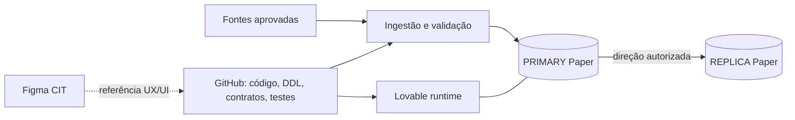

# CIT / Paper Comercial V2 — estado real, arquitetura e continuidade

> **Atualizado em 16/09/2026.** Este README é a porta de entrada do projeto e descreve o estado verificado da V2. Ele não significa que o produto comercial esteja concluído.
>
> Leitura complementar: [Mapa completo de engenharia](docs/architecture/mapa-cit-paper-v2.md), [AGENTS.md](AGENTS.md), [workflow de mudanças](docs/governance/change-workflow.md) e [contrato geográfico](docs/data-contracts/geografia-dtb-2025-cep5.md).

## 1. Resumo executivo

A V2 do CIT/Paper foi reconstruída sobre uma fundação nova, sem restaurar automaticamente regras comerciais do legado. O objetivo inicial foi criar um ambiente rastreável, versionado, auditável e seguro antes de reintroduzir regras de negócio.

Hoje estão implementados e validados:

- governança GitHub → Lovable PRIMARY → Supabase REPLICA;
- foundation de cargas, qualidade e auditoria;
- geografia DTB 2025;
- CEP5 com chave composta Município + CEP5;
- protocolo determinístico de checksum SHA-256;
- camada de ingestão, staging, revisão e grants;
- primeiro administrador no PRIMARY;
- roles e usuários técnicos de replicação;
- worker de replicação e reconciliação com paginação, replay, idempotência e gate de deleção;
- CI de aplicação e banco;
- certificado CA para conexões PostgreSQL com `sslmode=verify-full`;
- conexão técnica completa da REPLICA.

O principal bloqueio técnico atual é a **conexão externa do PRIMARY Lovable pelo GitHub Actions**. O Shared Pooler respondeu `tenant/user not found`; um probe de conexão direta foi adicionado e a última execução falhou novamente, mas **o motivo específico dessa última falha ainda não foi analisado**.

## 2. Arquitetura oficial



### Responsabilidades

| Camada | Papel |
|---|---|
| GitHub `Kaue-EDBS/papercomercialv2` | Fonte de verdade de código, DDL, migrations, contratos, testes e documentação. |
| Lovable `Paper Comercial OFICIAL` | Runtime e banco operacional PRIMARY. |
| Supabase externo | REPLICA independente. Nunca é autoridade para reparar o PRIMARY. |
| Figma CIT | Referência visual. Não define regra de negócio nem chave de dados. |
| Arquivos aprovados | Fonte dos datasets. Linhagem e hash devem ser preservados. |

Fluxo autorizado de dados: **PRIMARY → REPLICA**.

## 3. Ambientes e identificadores

- Repositório: `Kaue-EDBS/papercomercialv2`
- Branch operacional: `main`
- Lovable oficial: `8380d53b-a14d-4993-9447-d7c404347336`
- Projeto publicado: `Paper Comercial OFICIAL`
- URL publicada: `https://cit-edbs.lovable.app`
- Project ref utilizado pela aplicação: `chwsmkdkgdgocnbcyvmq`
- Supabase REPLICA: `vevmnoxbjdkibdwfygfn`
- Região da REPLICA: `sa-east-1`
- Figma: time `CIT`, Team ID `1681665672034047133`

O `project_id = "chwsmkdkgdgocnbcyvmq"` permanece correto em `supabase/config.toml`. Não substituir pelo project ref da REPLICA.

## 4. Migrations V2

DDL canônico:

```text
database/v2/0000_reset_legacy.sql
database/v2/0001_foundation.sql
database/v2/0002_geografia_dtb_2025_cep5.sql
database/v2/0003_cit_ingestion_access.sql
database/v2/0004_replication_control.sql
database/v2/0005_replication_roles.sql
database/v2/0006_replication_login_principals.sql
```

### Regra importante

`0000_reset_legacy.sql` registra o reset inicial da V2. **Não reaplicar sobre o estado atual.** Evoluções futuras devem ocorrer por novas migrations.

## 5. Foundation

As três tabelas base são:

- `etl_cargas`: registra origem, arquivo, status, volumes e execução das cargas;
- `audit_data_quality`: registra checks e resultados de qualidade;
- `audit_replication_runs`: registra execuções de replicação/reconciliação.

A foundation existe nos dois ambientes e está protegida por RLS e grants restritivos.

## 6. Geografia DTB 2025

Fonte: `COD_MUNICIPAL.zip`.

SHA-256 do arquivo original:

```text
a5947915a7213cddde00682a51d0734ea6b6ec2307d237d1e7937edde6766b99
```

Carga homologada:

```text
dataset: geografia_dtb_2025
carga_id: 934dafbe-0d0c-4463-8600-3faf0e623026
```

Resultado:

| Estrutura | Registros |
|---|---:|
| `dim_municipio` | 5.571 |
| `dim_distrito` | 10.751 |
| `dim_subdistrito` | 646 |
| Total DTB | 16.968 |

Também foram confirmados 27 UFs, 133 regiões intermediárias e 510 regiões imediatas.

`COD_MUNICIPAL` é a chave territorial canônica, armazenada como texto de sete dígitos.

## 7. CEP5

Fonte: `CEP5.xlsx`, aba `Resultados`.

SHA-256 do arquivo original:

```text
74ad34907a4ee418ededa872d3530cc11ae89270ed666331a6879ea72cb8cf13
```

Carga homologada:

```text
dataset: geografia_cep5
carga_id: 42229071-a0a3-4c0d-a8a8-14d7ead5895e
```

Resultado:

- 24.905 associações Município + CEP5;
- 24.896 CEP5 distintos;
- 5.570 municípios cobertos;
- 27 UFs;
- 4.495 registros e 4.495 CEP5 distintos iniciados por zero;
- nove CEP5 compartilhados entre municípios;
- `5101837` — Boa Esperança do Norte/MT — permanece válido na DTB e sem CEP5 na fonte atual.

A PK de `dim_cep5` é **`(cod_municipal, cep5)`**. Nunca tratar CEP5 sozinho como chave universal de município.

Aliases homologados nesta carga:

| Fonte | UF | Nome canônico | Código |
|---|---|---|---|
| São Luiz | RR | São Luiz do Anauá | `1400605` |
| Arês | RN | Arez | `2401206` |
| Açu | RN | Assú | `2400208` |

## 8. Paridade geográfica

O protocolo reproduzível é `sha256-json-array-lines-v1`: colunas de negócio fixas, arrays JSON, ordenação por PK, UTF-8, LF e sem LF final. `carga_id` e `atualizado_em` não entram no checksum de conteúdo.

| Tabela | Linhas | SHA-256 |
|---|---:|---|
| `dim_municipio` | 5.571 | `44b2d93b700d03b11ddb81ca1688b2d2f599e7eeffef2d6b3ab2cb2fd57d70f3` |
| `dim_distrito` | 10.751 | `5e3bfea56b4c8b82ca6f8a92f8ecd9f82ac4bfacc7c5825a8d5fdd5284dc3679` |
| `dim_subdistrito` | 646 | `2c9aeef8a0df9882883ae042decea8cf799d7b0e516292c30fc44b0ec83d981a` |
| `dim_cep5` | 24.905 | `346285b67463ee58bd2e27f30d46e59281cb9c6ef095c3d5e4389e5f7d884b56` |

As quatro dimensões somam **41.873 registros** e, na validação histórica executada, fonte normalizada = PRIMARY = REPLICA.

Essa paridade vale para as dimensões geográficas, não para todos os schemas, usuários ou extensões dos dois ambientes.

## 9. Ingestão V2

A migration `0003_cit_ingestion_access.sql` implementou a camada de ingestão.

Entrada pública controlada:

```text
cit_ingest(action, payload)
```

Estruturas internas principais:

- `cit_private.access_grants`
- `cit_private.ingestion_batches`
- `cit_private.ingestion_rows`
- `cit_private.review_events`
- `cit_private.municipality_aliases`

Papéis funcionais previstos:

- `admin`
- `operator`
- `reviewer`
- `viewer`

`VALIDATED` significa que o lote passou pela validação da staging; não significa promoção automática ao domínio de negócio.

A ingestão suporta CSV, TSV e JSON, SHA de servidor, replay controlado, limites de tamanho e revisão manual auditável.

## 10. Primeiro administrador

O primeiro grant administrativo foi criado no PRIMARY para o usuário autorizado definido durante a implantação. Existe exatamente um grant administrativo ativo nessa etapa inicial.

A REPLICA não possui usuários finais nem grants operacionais; ela não é uma segunda aplicação.

## 11. Replicação permanente

As migrations `0004`, `0005` e `0006` criaram a infraestrutura permanente.

Controle interno:

- `cit_private.replication_jobs`
- `cit_private.replication_pages`
- `cit_private.replication_items`

Group roles:

- `cit_replication_source`
- `cit_replication_target`

Login principals:

- `cit_replication_source_login`
- `cit_replication_target_login`

Os usuários técnicos seguem princípio de menor privilégio: sem superuser, sem createDB, sem createRole, sem native replication e sem bypassRLS; connection limit configurado em 2.

## 12. Worker de replicação

O worker versionado implementa:

- direção PRIMARY → REPLICA;
- allowlist de tabelas geográficas;
- ordenação respeitando FKs;
- leitura consistente da origem;
- paginação de 500 registros;
- checkpoints;
- replay após interrupção;
- promoção atômica no destino;
- hashes determinísticos;
- auditoria;
- gate explícito de deleções.

Modos:

```text
check   = comparar, sem reparar os dados de negócio
apply   = reparar a REPLICA usando o PRIMARY como autoridade
```

`allow_deletions=false` permanece o padrão. Não habilitar exclusões sem validação e autorização explícitas.

## 13. CI e testes

Existem atualmente workflows reais de CI:

- `CIT verification`
- `CIT database verification`
- `CIT manual replication`

Os testes cobrem, entre outros pontos, ingestão isolada, worker de replicação, interrupção/replay, gate de deleções, falhas e sanitização do preflight.

**CI verde prova o comportamento testado do código; não prova automaticamente conectividade de produção.**

## 14. SSL e certificado

As conexões técnicas utilizam:

```text
sslmode=verify-full
```

O GitHub Actions instala o certificado armazenado em:

```text
CIT_SUPABASE_CA_CERT
```

Certificado validado: **Supabase Root 2021 CA**, utilizado como trust anchor. O problema anterior de TLS foi resolvido.

## 15. Estado das conexões reais

### REPLICA

Conexão de produção validada completamente:

- DNS: OK
- IPv4: OK
- SSL/CA: OK
- autenticação: OK
- `current_user`: OK
- banco `postgres`: OK
- membership em `cit_replication_target`: OK

### PRIMARY

Internamente foram validados:

- `cit_replication_source_login` existe;
- `LOGIN = true`;
- `CONNECT` no banco = true;
- membership em `cit_replication_source` = true;
- privilégios internos compatíveis com o worker.

Na conexão externa pelo Shared Pooler, o preflight chegou ao servidor, passou DNS, rede e SSL, mas recebeu:

```text
FATAL: (ENOTFOUND) tenant/user not found
```

Isso isolou o problema na identificação do tenant/usuário pelo Supavisor, antes da autenticação PostgreSQL.

Em seguida foi adicionado um probe de conexão direta para `db.<project-ref>.supabase.co:5432`. A execução mais recente também falhou, mas **o log dessa última tentativa ainda não foi analisado**. Este é o ponto exato de retomada técnica.

## 16. Regras comerciais deliberadamente não restauradas

Continuam sem definição atual e não devem ser recuperadas automaticamente do histórico:

- chave canônica de escola/cliente;
- relação INEP × Protheus/ERP;
- metodologia de concorrência;
- raio/distância/geometria;
- uso comercial do CEP5;
- demografia;
- market share;
- mensalidade;
- potencial;
- Melhor Oferta;
- Zero Estoque;
- proposta;
- prospecção;
- renovação.

Essas regras serão especificadas após fechamento da infraestrutura essencial.

## 17. Pendências atuais

| Prioridade | Pendência |
|---|---|
| Alta | Analisar a última execução do probe direto do PRIMARY. |
| Alta | Determinar a forma oficialmente suportada de conexão externa ao PostgreSQL do Lovable. |
| Alta | Obter um `mode=check` real com PRIMARY e REPLICA conectados. |
| Alta | Executar E2E publicado: login → upload → validação → revisão → promoção → replicação. |
| Média | Revalidar contagens e checksums PRIMARY × REPLICA após replicação permanente. |
| Média | Rever/remover extensão HTTP remanescente no PRIMARY se comprovadamente desnecessária. |
| Média | Registrar link direto/fileKey do arquivo Figma correto. |
| Posterior | Definir os contratos comerciais da V2. |

## 18. Glossário rápido

| Termo | Significado simples |
|---|---|
| PRIMARY | Banco operacional principal. |
| REPLICA | Cópia independente do PRIMARY. |
| Migration | Arquivo SQL que registra mudança estrutural do banco. |
| DDL | SQL que cria ou altera estrutura. |
| Schema | Área lógica dentro do PostgreSQL. |
| PK | Chave que identifica unicamente um registro. |
| FK | Chave que relaciona uma tabela a outra. |
| Staging | Área temporária antes de promover dados oficiais. |
| Role | Grupo ou identidade de permissões no PostgreSQL. |
| RLS | Segurança no nível das linhas. |
| CI | Testes automáticos executados em mudanças de código. |
| Workflow | Sequência automatizada de tarefas no GitHub Actions. |
| Runner | Máquina temporária que executa um workflow. |
| Secret | Credencial armazenada de forma protegida. |
| DSN | String de conexão com banco. |
| SSL/TLS | Criptografia da conexão. |
| CA | Autoridade/certificado utilizado para confiar no servidor. |
| Pooler | Intermediário que gerencia conexões com o banco. |
| Supavisor | Pooler utilizado pela Supabase. |
| Tenant | Identificador de um projeto dentro de infraestrutura compartilhada. |
| Preflight | Teste de conectividade antes da operação principal. |
| Hash/checksum | Impressão digital usada para verificar integridade. |
| Idempotência | Repetir a operação sem gerar efeitos duplicados indevidos. |
| Replay | Retomar/repetir uma execução controladamente. |
| E2E | Teste ponta a ponta do fluxo real. |

## 19. Ponto exato de retomada

Ao retomar o projeto:

1. abrir a execução mais recente do `CIT manual replication` que contém o probe direto do PRIMARY;
2. identificar a categoria exata dessa falha, sem alterar secrets ou banco antes do diagnóstico;
3. decidir entre conexão direta suportada ou descoberta oficial do tenant/endpoint Lovable;
4. somente após PRIMARY e REPLICA passarem o preflight, executar `mode=check` completo;
5. depois validar paridade e avançar para o E2E real;
6. só então iniciar a fase de regras comerciais.

**Estado atual em uma frase:** a fundação, geografia, ingestão, CI e infraestrutura de replicação estão implementadas; a REPLICA está conectada; o bloqueio atual é a conexão externa do PRIMARY Lovable.