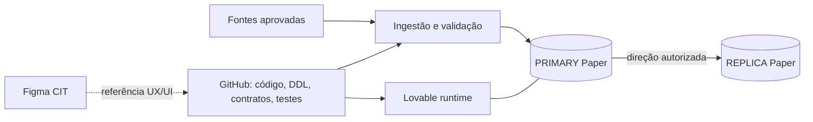

# CIT / Paper Comercial V2 — estado real, arquitetura e continuidade

> **Atualizado em 16/09/2026.** Este README é a porta de entrada do projeto e descreve o estado verificado da V2. Ele não significa que o produto comercial esteja concluído.
>
> Leitura complementar: [Mapa completo de engenharia](docs/architecture/mapa-cit-paper-v2.md), [AGENTS.md](AGENTS.md), [workflow de mudanças](docs/governance/change-workflow.md) e [contrato geográfico](docs/data-contracts/geografia-dtb-2025-cep5.md).

# REGRA DE CONTINUIDADE E EXPLICAÇÃO DIDÁTICA — OBRIGATÓRIA

Esta regra existe para que o projeto continue compreensível mesmo quando uma conversa, sessão ou agente mudar.

Ao finalizar qualquer processo relevante do CIT/Paper, a comunicação final deve explicar, em português claro e também em nível técnico:

1. **O que foi feito** — mudança realizada e arquivos/ambientes afetados.
2. **Por que foi feito** — problema de negócio ou de engenharia que a mudança resolve.
3. **Como funciona** — fluxo técnico explicado para iniciantes, definindo siglas e termos novos.
4. **O que foi validado** — testes, consultas, CI, contagens, hashes ou evidências realmente executadas.
5. **O que não foi validado** — limitações e pontos ainda pendentes, sem inferir sucesso.
6. **Estado final** — concluído, parcial, bloqueado ou pendente.
7. **Ponto exato de retomada** — próxima ação concreta para quem assumir a continuidade.

Quando aparecer um termo técnico novo — por exemplo migration, DDL, RLS, role, DSN, pooler, tenant, checksum, CI ou E2E — a explicação deve incluir uma tradução simples do conceito e por que ele é usado no CIT/Paper.

**Código escrito não é sinônimo de deploy; deploy não é sinônimo de teste; teste não é sinônimo de produção validada.** Essas etapas devem sempre ser distinguidas.

## 1. Resumo executivo

A V2 do CIT/Paper foi reconstruída sobre uma fundação nova, sem restaurar automaticamente regras comerciais do legado. O objetivo inicial foi criar um ambiente rastreável, versionado, auditável e seguro antes de reintroduzir regras de negócio.

Hoje estão implementados e validados:

- governança GitHub → Lovable PRIMARY → Supabase REPLICA;
- foundation de cargas, qualidade e auditoria;
- geografia DTB 2025;
- CEP5 com chave composta Município + CEP5;
- protocolo determinístico de checksum SHA-256;
- camada de ingestão, staging, revisão e grants;
- primeiro administrador no PRIMARY;
- roles e usuários técnicos de replicação;
- worker de replicação e reconciliação com paginação, replay, idempotência e gate de deleção;
- CI de aplicação e banco;
- certificado CA para conexões PostgreSQL com `sslmode=verify-full`;
- conexão técnica completa da REPLICA.

O principal bloqueio técnico atual é a **conexão externa do PRIMARY Lovable pelo GitHub Actions**. O diagnóstico já provou que o endpoint direto do PRIMARY resolve somente por IPv6 no runner utilizado e falha com `Network is unreachable`. O Shared Pooler IPv4 é, portanto, a rota adequada para o GitHub Actions, mas o host atualmente configurado respondeu `tenant/user not found`. O próximo passo é obter o **host exato do Session Pooler** do PRIMARY; o índice `aws-N` não pode ser deduzido apenas pela região.

## 2. Arquitetura oficial



| Camada | Papel |
|---|---|
| GitHub `Kaue-EDBS/papercomercialv2` | Fonte de verdade de código, DDL, migrations, contratos, testes e documentação. |
| Lovable `Paper Comercial OFICIAL` | Runtime e banco operacional PRIMARY. |
| Supabase externo | REPLICA independente. Nunca é autoridade para reparar o PRIMARY. |
| Figma CIT | Referência visual. Não define regra de negócio nem chave de dados. |
| Arquivos aprovados | Fonte dos datasets. Linhagem e hash devem ser preservados. |

Fluxo autorizado de dados: **PRIMARY → REPLICA**.

## 3. Ambientes e identificadores

- Repositório: `Kaue-EDBS/papercomercialv2`
- Branch operacional: `main`
- Lovable oficial: `8380d53b-a14d-4993-9447-d7c404347336`
- Projeto publicado: `Paper Comercial OFICIAL`
- URL publicada: `https://cit-edbs.lovable.app`
- Project ref utilizado pela aplicação: `chwsmkdkgdgocnbcyvmq`
- Supabase REPLICA: `vevmnoxbjdkibdwfygfn`
- Região da REPLICA: `sa-east-1`
- Figma: time `CIT`, Team ID `1681665672034047133`

O `project_id = "chwsmkdkgdgocnbcyvmq"` permanece correto em `supabase/config.toml`. Não substituir pelo project ref da REPLICA.

## 4. Migrations V2

DDL canônico atual:

```text
database/v2/0000_reset_legacy.sql
database/v2/0001_foundation.sql
database/v2/0002_geografia_dtb_2025_cep5.sql
database/v2/0003_cit_ingestion_access.sql
database/v2/0004_replication_control.sql
database/v2/0005_replication_roles.sql
database/v2/0006_replication_login_principals.sql
```

`0000_reset_legacy.sql` registra o reset inicial da V2. **Não reaplicar sobre o estado atual.** Evoluções futuras devem ocorrer por novas migrations.

## 5. Foundation

As três tabelas base são:

- `etl_cargas`: registra origem, arquivo, status, volumes e execução das cargas;
- `audit_data_quality`: registra checks e resultados de qualidade;
- `audit_replication_runs`: registra execuções de replicação/reconciliação.

A foundation existe nos dois ambientes e está protegida por RLS e grants restritivos.

## 6. Geografia DTB 2025

Fonte: `COD_MUNICIPAL.zip`.

SHA-256 do arquivo original:

```text
a5947915a7213cddde00682a51d0734ea6b6ec2307d237d1e7937edde6766b99
```

Carga homologada:

```text
dataset: geografia_dtb_2025
carga_id: 934dafbe-0d0c-4463-8600-3faf0e623026
```

| Estrutura | Registros |
|---|---:|
| `dim_municipio` | 5.571 |
| `dim_distrito` | 10.751 |
| `dim_subdistrito` | 646 |
| Total DTB | 16.968 |

Também foram confirmados 27 UFs, 133 regiões intermediárias e 510 regiões imediatas. `COD_MUNICIPAL` é a chave territorial canônica, armazenada como texto de sete dígitos.

## 7. CEP5

Fonte: `CEP5.xlsx`, aba `Resultados`.

SHA-256 do arquivo original:

```text
74ad34907a4ee418ededa872d3530cc11ae89270ed666331a6879ea72cb8cf13
```

Carga homologada:

```text
dataset: geografia_cep5
carga_id: 42229071-a0a3-4c0d-a8a8-14d7ead5895e
```

Resultado:

- 24.905 associações Município + CEP5;
- 24.896 CEP5 distintos;
- 5.570 municípios cobertos;
- 27 UFs;
- 4.495 registros e 4.495 CEP5 distintos iniciados por zero;
- nove CEP5 compartilhados entre municípios;
- `5101837` — Boa Esperança do Norte/MT — permanece válido na DTB e sem CEP5 na fonte atual.

A PK de `dim_cep5` é **`(cod_municipal, cep5)`**. Nunca tratar CEP5 sozinho como chave universal de município.

### Regra exclusiva — Boa Esperança do Norte/MT (`5101837`)

Boa Esperança do Norte é município válido da DTB atual, mas a fonte CEP5 homologada não possui recorte para ele. Por decisão de negócio da V2:

- **não criar, inferir ou emprestar CEP5** de outro município;
- qualquer função que normalmente dependa de CEP5 deve usar, exclusivamente para `5101837`, o escopo **`MUNICIPIO_INTEIRO`**;
- um CEP5 recebido para esse município não deve ser usado como filtro territorial normalizado;
- a interface deve exibir **“Município inteiro — sem recorte CEP5 na fonte aprovada”**;
- a ausência de CEP5 não pode bloquear a operação quando o município já estiver identificado como `5101837`;
- o payload bruto continua preservado para auditoria.

Essa é uma **exceção explícita e exclusiva**, não uma regra genérica para municípios sem CEP5. Outros casos futuros exigem homologação própria.

Aliases homologados nesta carga:

| Fonte | UF | Nome canônico | Código |
|---|---|---|---|
| São Luiz | RR | São Luiz do Anauá | `1400605` |
| Arês | RN | Arez | `2401206` |
| Açu | RN | Assú | `2400208` |

## 8. Paridade geográfica

O protocolo reproduzível é `sha256-json-array-lines-v1`: colunas de negócio fixas, arrays JSON, ordenação por PK, UTF-8, LF e sem LF final. `carga_id` e `atualizado_em` não entram no checksum de conteúdo.

| Tabela | Linhas | SHA-256 |
|---|---:|---|
| `dim_municipio` | 5.571 | `44b2d93b700d03b11ddb81ca1688b2d2f599e7eeffef2d6b3ab2cb2fd57d70f3` |
| `dim_distrito` | 10.751 | `5e3bfea56b4c8b82ca6f8a92f8ecd9f82ac4bfacc7c5825a8d5fdd5284dc3679` |
| `dim_subdistrito` | 646 | `2c9aeef8a0df9882883ae042decea8cf799d7b0e516292c30fc44b0ec83d981a` |
| `dim_cep5` | 24.905 | `346285b67463ee58bd2e27f30d46e59281cb9c6ef095c3d5e4389e5f7d884b56` |

As quatro dimensões somam **41.873 registros** e, na validação histórica executada, fonte normalizada = PRIMARY = REPLICA. Essa paridade vale para as dimensões geográficas, não para todos os schemas, usuários ou extensões dos dois ambientes.

## 9. Ingestão V2

A migration `0003_cit_ingestion_access.sql` implementou a camada de ingestão.

Entrada pública controlada:

```text
cit_ingest(action, payload)
```

Estruturas internas principais:

- `cit_private.access_grants`
- `cit_private.ingestion_batches`
- `cit_private.ingestion_rows`
- `cit_private.review_events`
- `cit_private.municipality_aliases`

Papéis funcionais: `admin`, `operator`, `reviewer` e `viewer`.

`VALIDATED` significa que o lote passou pela validação da staging; não significa promoção automática ao domínio de negócio. A ingestão suporta CSV, TSV e JSON, SHA de servidor, replay controlado, limites de tamanho e revisão manual auditável.

## 10. Replicação permanente

As migrations `0004`, `0005` e `0006` criaram a infraestrutura permanente.

Controle interno:

- `cit_private.replication_jobs`
- `cit_private.replication_pages`
- `cit_private.replication_items`

Group roles:

- `cit_replication_source`
- `cit_replication_target`

Login principals:

- `cit_replication_source_login`
- `cit_replication_target_login`

Os usuários técnicos seguem princípio de menor privilégio: sem superuser, createDB, createRole, native replication ou bypassRLS; connection limit configurado em 2.

## 11. Worker, CI e segurança de conexão

O worker implementa direção PRIMARY → REPLICA, allowlist, ordenação por FK, paginação de 500 registros, checkpoints, replay, promoção atômica, hashes, auditoria e gate de deleções.

```text
check   = comparar, sem reparar os dados de negócio
apply   = reparar a REPLICA usando o PRIMARY como autoridade
```

`allow_deletions=false` permanece o padrão.

Workflows atuais:

- `CIT verification`
- `CIT database verification`
- `CIT manual replication`

As conexões PostgreSQL usam `sslmode=verify-full` e o GitHub Actions instala o `CIT_SUPABASE_CA_CERT`. O certificado Supabase Root 2021 CA foi validado. O problema anterior de TLS está resolvido.

## 12. Estado das conexões reais

### REPLICA

Validado em produção:

- DNS e IPv4: OK;
- SSL/CA: OK;
- autenticação: OK;
- `current_user`: OK;
- banco `postgres`: OK;
- membership em `cit_replication_target`: OK.

### PRIMARY

Internamente estão comprovados:

- `cit_replication_source_login` existe;
- `LOGIN = true`;
- `CONNECT` no banco = true;
- membership em `cit_replication_source` = true.

O Shared Pooler atualmente configurado (`aws-0-us-east-1...`) responde:

```text
FATAL: (ENOTFOUND) tenant/user not found
```

O probe direto `db.chwsmkdkgdgocnbcyvmq.supabase.co:5432` foi executado e resolveu apenas para IPv6. O GitHub Runner retornou:

```text
Network is unreachable
```

Logo, a falha do probe direto **não é evidência de senha incorreta nem de usuário PostgreSQL inválido**; ela mostra falta de rota IPv6 no runner utilizado.

A documentação atual da Supabase determina que o Shared Pooler em Session mode usa IPv4 e que o host contém um índice de cluster `aws-[INDEX]-[REGION]`. Esse índice **não pode ser deduzido pela região**. Portanto `aws-0` não deve ser tratado como padrão. O próximo diagnóstico correto é obter/copiar o host oficial do Session Pooler do PRIMARY no painel de conexão do backend gerenciado.

Até isso ocorrer, **não resetar senha, não alterar roles e não executar `apply`**.

## 13. Regras comerciais deliberadamente não restauradas

Continuam sem definição atual e não devem ser recuperadas automaticamente do histórico:

- chave canônica de escola/cliente;
- relação INEP × Protheus/ERP;
- metodologia de concorrência;
- raio/distância/geometria;
- demografia;
- market share;
- mensalidade;
- potencial;
- Melhor Oferta;
- Zero Estoque;
- proposta;
- prospecção;
- renovação.

A exceção de Boa Esperança do Norte descrita acima é uma regra territorial aprovada da V2 e não reativa nenhuma regra comercial legada.

## 14. Pendências atuais

| Prioridade | Pendência |
|---|---|
| Alta | Implementar e testar a exceção `5101837 → MUNICIPIO_INTEIRO` nas funções CEP5 e camada de apresentação. |
| Alta | Obter o host oficial do Session Pooler do PRIMARY. |
| Alta | Atualizar `CIT_PRIMARY_DATABASE_URL` somente com o host oficialmente confirmado, mantendo usuário técnico e `sslmode=verify-full`. |
| Alta | Obter um `mode=check` real com PRIMARY e REPLICA conectados. |
| Alta | Executar E2E publicado: login → upload → validação → revisão → promoção → replicação. |
| Média | Revalidar contagens e checksums PRIMARY × REPLICA após replicação permanente. |
| Média | Rever/remover extensão HTTP remanescente no PRIMARY se comprovadamente desnecessária. |
| Média | Registrar link direto/fileKey do arquivo Figma correto. |
| Posterior | Definir os demais contratos comerciais da V2. |

## 15. Glossário rápido

| Termo | Significado simples |
|---|---|
| PRIMARY | Banco operacional principal. |
| REPLICA | Cópia independente do PRIMARY. |
| Migration | Arquivo SQL que registra mudança estrutural do banco. |
| DDL | SQL que cria ou altera estrutura. |
| Schema | Área lógica dentro do PostgreSQL. |
| PK | Chave que identifica unicamente um registro. |
| FK | Chave que relaciona uma tabela a outra. |
| Staging | Área temporária antes de promover dados oficiais. |
| Role | Grupo ou identidade de permissões no PostgreSQL. |
| RLS | Segurança no nível das linhas. |
| CI | Testes automáticos executados em mudanças de código. |
| Workflow | Sequência automatizada de tarefas no GitHub Actions. |
| Runner | Máquina temporária que executa um workflow. |
| Secret | Credencial armazenada de forma protegida. |
| DSN | String de conexão com banco. |
| SSL/TLS | Criptografia da conexão. |
| CA | Autoridade/certificado utilizado para confiar no servidor. |
| Pooler | Intermediário que gerencia conexões com o banco. |
| Supavisor | Pooler compartilhado utilizado pela Supabase. |
| Tenant | Identificador do projeto dentro da infraestrutura compartilhada. |
| Preflight | Teste de conectividade antes da operação principal. |
| Hash/checksum | Impressão digital usada para verificar integridade. |
| Idempotência | Repetir a operação sem gerar efeitos duplicados indevidos. |
| Replay | Retomar/repetir uma execução controladamente. |
| E2E | Teste ponta a ponta do fluxo real. |
| IPv4/IPv6 | Duas famílias de endereçamento de rede; uma rota pode suportar uma e não a outra. |
| Session Pooler | Conexão PostgreSQL via Supavisor que preserva sessão e oferece acesso IPv4. |

## 16. Ponto exato de retomada

1. fechar a implementação da exceção de Boa Esperança do Norte e seus testes;
2. confirmar o host oficial do Session Pooler do PRIMARY — sem inferir o índice `aws-N`;
3. atualizar somente o secret de conexão necessário;
4. executar `CIT manual replication` com `mode=check` e `allow_deletions=false`;
5. somente se PRIMARY e REPLICA passarem o preflight, executar a reconciliação em modo de checagem;
6. validar contagens e checksums;
7. avançar para o E2E real;
8. ao concluir cada etapa, aplicar a **REGRA DE CONTINUIDADE E EXPLICAÇÃO DIDÁTICA** deste README.

**Estado atual em uma frase:** a fundação, geografia, ingestão, CI e infraestrutura de replicação estão implementadas; a REPLICA está conectada; o bloqueio técnico atual é descobrir o host oficial do Session Pooler do PRIMARY Lovable.