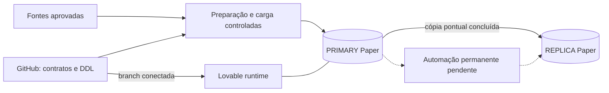

# CIT / Paper Comercial V2 — Estado real e continuidade

> **Última auditoria: 15/09/2026.** Este README é o ponto de entrada, não uma declaração de plataforma totalmente concluída.
> **Leia primeiro:** [Mapa completo de engenharia](docs/architecture/mapa-cit-paper-v2.md), [AGENTS.md](AGENTS.md) e [workflow](docs/governance/change-workflow.md).

## 1. Onde estamos, sem confundir as camadas

**A fundação técnica e a carga geográfica estão concluídas. O pipeline automático de ingestão, revisão, replicação e reconciliação ainda não está implementado/homologado no CIT/Paper.**

| Camada | Estado verificado |
|---|---|
| Governança e DDL V2 | Versionados no GitHub. |
| Geografia DTB 2025 | 5.571 municípios, 10.751 distritos e 646 subdistritos nos dois bancos. |
| CEP5 | 24.905 associações Município + CEP5 nos dois bancos. |
| Paridade dos dados geográficos | Confirmada por contagem e SHA-256; fontes normalizadas e ambos os bancos coincidem. |
| Auditoria de cargas e qualidade | Duas cargas concluídas e dois checks aprovados em cada ambiente. |
| Histórico de replicação | Parcial: um run CEP5 no PRIMARY e nenhum na REPLICA; não há runs DTB individuais. |
| Validação municipal/CEP5 como serviço | Ainda não implementada/homologada. |
| Staging, aliases reutilizáveis e revisão humana | Ainda não implementados. |
| Replicação e reconciliação permanentes | Pendentes; houve operações pontuais, não automação contínua. |
| Frontend | Tela neutra, sem consumo das dimensões ou regras comerciais. |
| Autenticação do produto V2 | Não implementada na interface atual; infraestrutura e contas da plataforma preservadas. |
| Figma | Time CIT identificado; arquivo direto/fileKey ainda pendente. |

**Não confundir:** dados carregados não significam serviços prontos; tabela de auditoria não é orquestrador; biblioteca UI não é tela funcional; SDK de autenticação não é autorização do produto.

## 2. Mapa de leitura

| Documento | Quando consultar |
|---|---|
| [Mapa completo de engenharia](docs/architecture/mapa-cit-paper-v2.md) | Contexto, cinco diagramas editáveis, modelo relacional, arquitetura atual versus futura, segurança, pendências e roteiro. |
| [Snapshot de evidências](docs/testing/cit-paper-snapshot-2026-09-15.json) | Contagens, hashes, ambientes, limitações e estado verificado de cada camada. |
| [Consultas de verificação](database/validation/geografia_snapshot_readonly.sql) | Repetir consultas somente leitura, separadamente no PRIMARY e na REPLICA. |
| [Contrato geográfico](docs/data-contracts/geografia-dtb-2025-cep5.md) | Semântica, chaves, fontes, aliases e limites de uso. |
| [Índice do banco](database/v2/README.md) | DDL canônico e escopo das migrations. |
| [Arquitetura](docs/architecture/README.md) | Visão de entrada da arquitetura. |
| [Replicação](docs/replication/lovable-to-supabase.md) | O que foi executado e o que falta automatizar. |

A auditoria usou como base de código `aedaaef212d0a60c448bb1b55642e6cbaf046bd4`. Os documentos acima foram adicionados/atualizados em commits posteriores. Consulte o histórico para saber o que mudou depois do snapshot.

## 3. Isolamento e fontes da verdade

O CIT/Paper é autônomo. Nenhum outro projeto, banco ou aplicação é fonte, transporte, fallback, especificação ou benchmark obrigatório sem pedido explícito do usuário.

| Camada | Responsabilidade |
|---|---|
| GitHub `Kaue-EDBS/papercomercialv2` | Código, DDL, contratos, testes, decisões e documentação. |
| Lovable `Paper Comercial OFICIAL` | Runtime e banco operacional PRIMARY. |
| Supabase externo do Paper | REPLICA independente, sem escrita autoritativa de volta. |
| Figma CIT | Referência visual aprovada, não fonte de regra comercial. |
| Arquivos-fonte aprovados | Origem dos dados; sua linhagem deve ser preservada. |
| ChatGPT | Implementação assistida e QA; não substitui documentação ou execução verificável. |



Fluxo autorizado de dados: **PRIMARY → REPLICA**. Nunca reparo automático no sentido contrário.

## 4. Ambientes e identificadores

- Repositório: `Kaue-EDBS/papercomercialv2`; branch operacional `main`.
- Lovable PRIMARY: `8380d53b-a14d-4993-9447-d7c404347336`, projeto `Paper Comercial OFICIAL`.
- Supabase REPLICA: `vevmnoxbjdkibdwfygfn`, região registrada `sa-east-1`.
- `supabase/config.toml`: `project_id = "chwsmkdkgdgocnbcyvmq"`.
- Figma: time `CIT`, `1681665672034047133`.

A associação de `chwsm...` ao backend gerenciado PRIMARY continua sendo **inferência técnica, não confirmação administrativa**. Não substituir esse ID por `vevm...`.

O link Figma recebido é de workspace/time, não de arquivo Design. `SIGMA` é um nome antigo/incorreto informado pelo usuário, não outro produto. A conexão consultada retorna Starter/View; o arquivo específico e suas permissões ainda precisam ser identificados. Não criar arquivo substituto por iniciativa própria.

## 5. Banco atual

| Tabela | Colunas | PRIMARY | REPLICA | Papel |
|---|---:|---:|---:|---|
| `etl_cargas` | 16 | 2 | 2 | Origem, arquivo, status, volumes e execução de cargas. |
| `audit_data_quality` | 8 | 2 | 2 | Checks e resultados. |
| `audit_replication_runs` | 16 | 1 | 0 | Histórico parcial de replicação. |
| `dim_municipio` | 14 | 5.571 | 5.571 | Município canônico e atributos regionais. |
| `dim_distrito` | 9 | 10.751 | 10.751 | Distritos por município. |
| `dim_subdistrito` | 10 | 646 | 646 | Subdistritos por distrito/município. |
| `dim_cep5` | 8 | 24.905 | 24.905 | Associação territorial Município + CEP5. |

As sete estruturas comparadas coincidem. As quatro dimensões somam **41.873 registros por ambiente**. Não há tabela física separada de UF, região intermediária ou região imediata: são atributos de `dim_municipio`.

```text
UF → Região Intermediária → Região Imediata → Município
                                                ├─ Distrito → Subdistrito
                                                └─ Associação Município + CEP5
```

## 6. Fontes e cargas homologadas

| Dataset | Fonte | carga_id | Estado |
|---|---|---|---|
| `geografia_dtb_2025` | `COD_MUNICIPAL.zip`, DTB 2025, data-base 31/12/2025 | `934dafbe-0d0c-4463-8600-3faf0e623026` | Concluída nos dois bancos. |
| `geografia_cep5` | `CEP5.xlsx`, aba `Resultados` | `42229071-a0a3-4c0d-a8a8-14d7ead5895e` | Concluída nos dois bancos. |

SHA-256 dos arquivos originais:

```text
COD_MUNICIPAL.zip
a5947915a7213cddde00682a51d0734ea6b6ec2307d237d1e7937edde6766b99

CEP5.xlsx
74ad34907a4ee418ededa872d3530cc11ae89270ed666331a6879ea72cb8cf13
```

Nesta auditoria, os originais foram relidos e comparados aos CSVs normalizados e aos dois bancos. Fonte institucional da geografia: IBGE. Para CEP5, a fonte aprovada é o arquivo fornecido pelo usuário; não atribuir certificação postal externa ou metodologia demográfica que não tenha sido documentada.

## 7. Regras geográficas já definidas

`COD_MUNICIPAL` é o cabeçalho lógico e `cod_municipal` o nome físico PostgreSQL. O código municipal canônico é texto de sete dígitos. O CEP5 é texto de cinco dígitos, preservando zeros à esquerda.

A PK de `dim_cep5` é **`(cod_municipal, cep5)`**, nunca apenas CEP5.

Resultados verificados:

- 24.905 associações; 24.896 CEP5 distintos;
- 5.570 municípios cobertos; 27 UFs;
- **4.495 CEP5 distintos iniciados por zero** — o número 248 publicado anteriormente estava incorreto na documentação, não nos dados;
- nove CEP5 compartilhados entre municípios;
- três aliases tratados explicitamente;
- zero órfãos nos checks de FK/hierarquia e zero CEP5 fora do formato;
- `5101837` permanece válido na DTB, sem CEP5 na fonte atual.

Aliases desta carga:

| Fonte | UF | Nome canônico | Código |
|---|---|---|---|
| São Luiz | RR | São Luiz do Anauá | `1400605` |
| Arês | RN | Arez | `2401206` |
| Açu | RN | Assú | `2400208` |

Esses três tratamentos **não constituem um serviço reutilizável de aliases**. CEP5 é referência para futuros contratos de concorrência/demografia; não há regra comercial, distância, polígono ou cálculo demográfico implementado por essa dimensão.

## 8. Paridade: conteúdo e limites

Protocolo novo e reproduzível da auditoria: `sha256-json-array-lines-v1`. Colunas de negócio em arrays JSON, ordenadas por PK, separadas por LF, UTF-8, sem LF final. `carga_id` e `atualizado_em` ficam fora do checksum de conteúdo.

| Tabela | SHA-256 idêntico em fonte normalizada, PRIMARY e REPLICA |
|---|---|
| `dim_municipio` | `44b2d93b700d03b11ddb81ca1688b2d2f599e7eeffef2d6b3ab2cb2fd57d70f3` |
| `dim_distrito` | `5e3bfea56b4c8b82ca6f8a92f8ecd9f82ac4bfacc7c5825a8d5fdd5284dc3679` |
| `dim_subdistrito` | `2c9aeef8a0df9882883ae042decea8cf799d7b0e516292c30fc44b0ec83d981a` |
| `dim_cep5` | `346285b67463ee58bd2e27f30d46e59281cb9c6ef095c3d5e4389e5f7d884b56` |

Os hashes de 32 caracteres registrados nas cargas anteriores são MD5 históricos. Eles não foram apagados nem convertidos retroativamente em SHA-256.

**A paridade comprovada é das dimensões geográficas, não dos bancos inteiros.** `audit_replication_runs` contém um run de CEP5 no PRIMARY e nenhum na REPLICA. Contas Auth e extensões também diferem. A política de replicar metadados/auditoria precisa ser formalizada; não inventar eventos históricos para preencher lacunas.

## 9. Pipeline e Edge Functions

Não há implementações V2 versionadas de `validate-cod-municipal`, revisão manual, `replicate-dataset` ou `reconcile-replica`. A árvore auditada não contém `supabase/functions/`; a REPLICA retornou zero Edge Functions. O catálogo administrativo completo do PRIMARY gerenciado não foi obtido, portanto nenhum deploy fora do repositório é considerado homologado.

Faltam construir: staging persistente; validação de lote; auditoria de correções; regras reutilizáveis homologadas; modal de revisão; registry/allowlist; replicação paginada/idempotente; reconciliação permanente; gate de publicação; testes E2E do fluxo completo.

A carga geográfica utilizou operações pontuais. Os helpers `tmp_*` foram removidos do escopo verificado. Não existe subscription PostgreSQL ou `cron.job` nos bancos auditados. Agendadores externos não foram homologados nesta revisão.

## 10. Frontend, autenticação e segurança

O código atual preserva React/Vite, TypeScript, Tailwind, componentes UI genéricos e integração Supabase. `src/App.tsx` exibe somente a tela neutra; seus textos ainda precisam ser alinhados com a existência dos dados geográficos.

`src/integrations/supabase/types.ts` descreve apenas as três tabelas técnicas. **Falta incluir as quatro dimensões**, antes de conectá-las à interface.

A infraestrutura Auth possui **28 usuários e 28 identidades no PRIMARY**, e zero na REPLICA. Isso não significa login ou autorização V2 implementados. Não excluir contas nem atribuir-lhes acesso por inferência. Papéis, provedores, signup e testes de acesso ainda exigem definição/validação.

As sete tabelas possuem RLS e nenhum privilégio efetivo de tabela para `anon`/`authenticated`. A REPLICA retornou somente avisos informativos de RLS sem policy nessa verificação. Não transformar esse resultado em auditoria de segurança completa de toda a aplicação.

Pendências: `.env` versionado ainda não classificado; extensão HTTP permanece no PRIMARY; nenhum bucket/objeto Storage encontrado; retenção durável das fontes e procedimento de recuperação precisam ser definidos. A REPLICA não substitui backup versionado com restauração testada.

## 11. DDL, histórico e governança

DDL canônico:

```text
database/v2/0000_reset_legacy.sql
database/v2/0001_foundation.sql
database/v2/0002_geografia_dtb_2025_cep5.sql
```

A migration `0000` registra o reset antigo. **Não reaplicá-la sobre os dados atuais.** `0003+` depende de novo escopo/contrato; os SQLs em `database/validation/` são consultas, não migrations.

O reset funcional foi consolidado no merge `f026c78f1f98d2142271118cf6adc339e1bfa867`. Regras comerciais, páginas, hooks de negócio, planos antigos e migrations legadas foram removidos da branch vigente. O histórico continua como evidência, não especificação autorizada.

Toda mudança permanente deve passar por GitHub + commit. Não enviar mensagens ao agente do Lovable para implementar código. SQL versionado precisa de aplicação controlada e verificação posterior; a mera existência do arquivo no GitHub não significa migration aplicada.

## 12. Testes e limitações

Foram verificados código central, árvore Git, contagens, estrutura das sete tabelas, privilégios efetivos, fontes originais, hashes de conteúdo, qualidade geográfica, catálogo de funções da REPLICA e identidade do workspace Figma.

Não foram executados build/lint/testes do frontend, navegação no runtime publicado, login real, E2E de upload/revisão ou restauração após falha. O acesso Git local falhou por resolução DNS de `github.com`.

Há configuração Vitest/Playwright, mas o teste de exemplo inspecionado apenas verifica `expect(true).toBe(true)`. Não existem workflows CI na árvore auditada. Não reportar cobertura de testes de negócio com base nesse exemplo.

## 13. Próximas decisões

O mapa detalhado inclui pendências P01–P11 com critérios de conclusão. Antes de ingestão autônoma ou liberação para usuários, priorizar credenciais, tipos, autorização, staging/validação e replicação/reconciliação permanentes. CI, trilha de auditoria, reprocessamento, texto da tela neutra e arquivo Figma também precisam de fechamento.

Permanecem sem definição: identidade escolar/comercial; relação INEP/ERP; metodologia de concorrência e demografia; raio/geometria; market share; mensalidade; potencial; oferta; estoque e proposta. Nada disso deve voltar do histórico automaticamente.

## 14. Ponto exato de retomada

1. Ler este README, `AGENTS.md`, o mapa completo e o contrato geográfico.
2. Confirmar o estado atual antes de escrever; o snapshot é datado.
3. Preservar os dados DTB/CEP5 já carregados; não repetir reset ou recarga desnecessária.
4. Escolher com o usuário o próximo escopo de implementação.
5. Versionar mudanças, executar testes aplicáveis e distinguir código, deploy e resultado em banco.
6. Atualizar mapa, README e evidências após mudanças estruturais.

**Resumo final: geografia e CEP5 íntegros; serviços automáticos e aplicação funcional ainda em reconstrução.**
