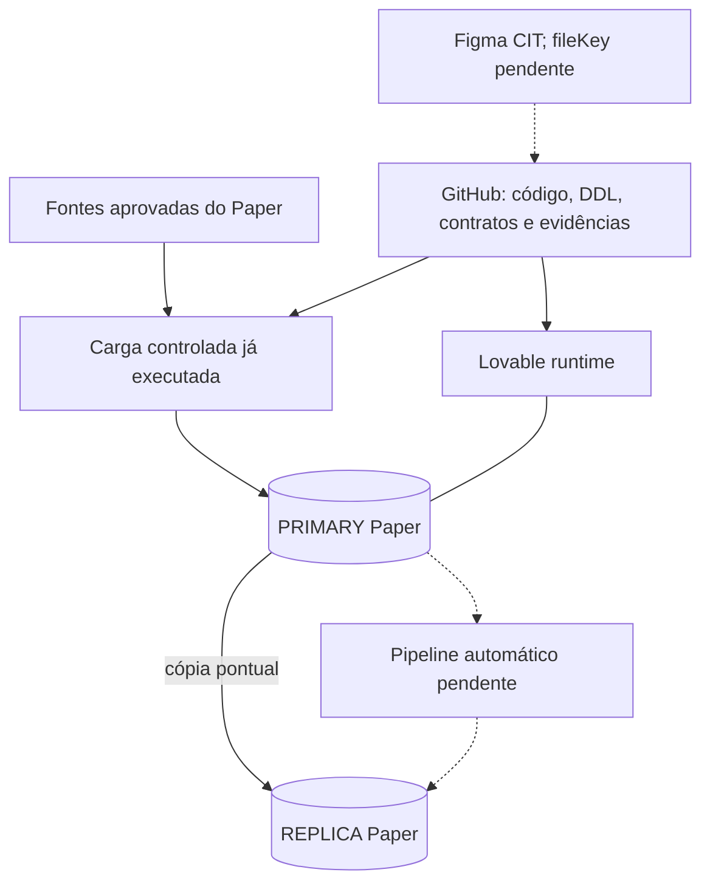

# Arquitetura — CIT / Paper Comercial V2

> Estado auditado em **15/09/2026**. Escopo exclusivo do CIT/Paper.

## Documento principal

O [Mapa completo de engenharia](mapa-cit-paper-v2.md) é a referência detalhada de continuidade. Contém 19 seções e cinco diagramas Mermaid editáveis: contexto, modelo relacional, linhagem, pipeline-alvo e fluxo de mudanças.

Evidências: [snapshot estruturado](../testing/cit-paper-snapshot-2026-09-15.json). Consultas reproduzíveis: [SQL somente leitura](../../database/validation/geografia_snapshot_readonly.sql).

## Resumo correto

A fundação técnica e as quatro dimensões geográficas estão carregadas e verificadas. O pipeline permanente de validação, staging, revisão humana, replicação e reconciliação **ainda não foi implementado/homologado**. As cargas e comparações já realizadas foram operações pontuais.

## Ambientes

| Camada | Identificação |
|---|---|
| GitHub | `Kaue-EDBS/papercomercialv2`, branch `main` |
| Lovable PRIMARY | `8380d53b-a14d-4993-9447-d7c404347336` |
| Supabase REPLICA | `vevmnoxbjdkibdwfygfn` |
| `config.toml` | `chwsmkdkgdgocnbcyvmq`; associação ao PRIMARY ainda inferida, não confirmada administrativamente |
| Figma | time CIT `1681665672034047133`; arquivo direto pendente |

Não trocar `config.toml` para o ID da REPLICA. Não consultar projetos externos como fonte, transporte ou especificação sem pedido explícito.

## Banco e aplicação

Sete tabelas em `public`: `etl_cargas`, `audit_data_quality`, `audit_replication_runs`, `dim_municipio`, `dim_distrito`, `dim_subdistrito` e `dim_cep5`.

As quatro dimensões têm **41.873 registros por banco**, com hashes SHA-256 idênticos aos arquivos normalizados. UF e regiões são atributos de município, não tabelas físicas separadas. A PK do CEP5 é `(cod_municipal, cep5)`.

A estrutura das sete tabelas coincide, mas os bancos inteiros não são idênticos: a trilha de replicação tem 1 run no PRIMARY e 0 na REPLICA; Auth possui 28 contas no PRIMARY e 0 na REPLICA. As contas preservadas não são uma política de autorização V2.

RLS está ativo nas sete tabelas e não há privilégios efetivos de tabela para `anon`/`authenticated`. O frontend permanece neutro e não consome as dimensões. Os tipos TypeScript ainda descrevem somente as três tabelas técnicas.

## Regras de continuidade

GitHub + commit para mudanças permanentes; nenhum prompt ao agente Lovable para implementar código. DDL em Git não prova aplicação no banco; código de função em Git não prova deploy; deploy não prova E2E.

Não reaplicar o reset `0000` sobre os dados atuais. Não reativar regras comerciais antigas. Novas funcionalidades exigem contrato e testes próprios.

O mapa completo distingue fatos verificados, operações pontuais, diretrizes futuras e itens não verificados. Leia suas pendências P01–P11 antes de começar o próximo escopo.
