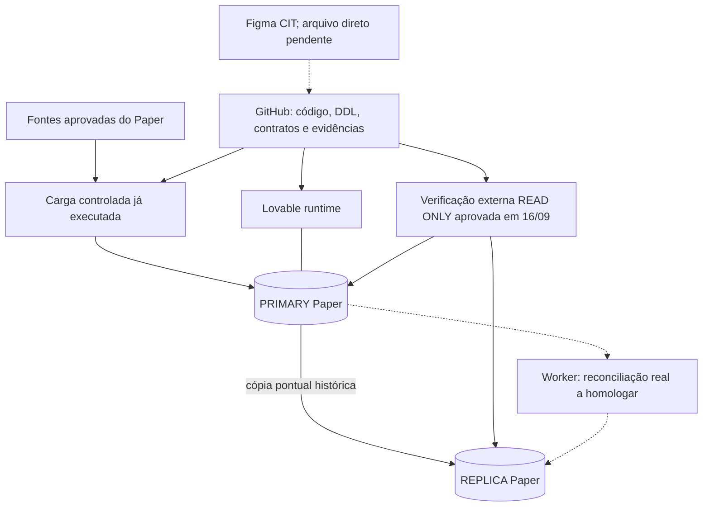

# Arquitetura — CIT / Paper Comercial V2

> **Atualização verificada em 16/09/2026, 14:06 de Brasília:** o bloqueio de conexão externa do PRIMARY foi resolvido pelo PR #11. PRIMARY e REPLICA passaram na autenticação e leitura geográfica pelo GitHub Actions. Consulte a [evidência de produção](../testing/primary-connection-2026-09-16.json) e o [contrato de conexão](../replication/primary-session-pooler.md).
>
> Esta atualização substitui, exclusivamente quanto à conectividade, as indicações anteriores de PRIMARY bloqueado presentes no README raiz e no mapa técnico. Esses registros descrevem etapas anteriores; não devem levar a repetir o diagnóstico já encerrado. A reconciliação real com auditoria e o E2E publicado continuam separados e pendentes de homologação.

## Estado atual de conectividade

A implementação funcional está no commit `4e426bc1e95c17916a3b10e1642366c3164f3b2f`. O run [35126088433](https://github.com/Kaue-EDBS/papercomercialv2/actions/runs/35126088433) comprovou IPv4, TLS `verify-full`, autenticação, banco e membership das roles nos dois ambientes. Os quatro conjuntos geográficos mantêm 41.873 registros por banco e hashes SHA-256 iguais ao baseline aprovado. As definições das funções da migration `0007` também foram confirmadas.

O secret armazenado não foi editado: `scripts/primary_session.py` mantém as credenciais e usa `aws-1-us-east-1.pooler.supabase.com:5432` em memória. O workflow manual foi ajustado para usar o mesmo ponto de entrada. A nova verificação de conexão não grava dados de negócio, auditoria ou controle; não chama `check` nem `apply` do replicador.

Próxima etapa operacional: reconciliar em `check` na main corrigida, com `allow_deletions=false`, sabendo que haverá gravação de auditoria/controle. O teste de conexão não equivale a essa homologação nem ao E2E da interface.

## Registro histórico de arquitetura — 15/09/2026

O restante desta seção preserva o snapshot inicial, não uma declaração de que todos esses pontos permanecem inalterados. O código de ingestão e replicação evoluiu posteriormente; use os contratos e evidências mais recentes para determinar o estado atual.

### Documentos e evidências de origem

O [Mapa completo de engenharia](mapa-cit-paper-v2.md) é a referência detalhada da trajetória do projeto. Evidências iniciais: [snapshot estruturado](../testing/cit-paper-snapshot-2026-09-15.json). Consultas reproduzíveis: [SQL somente leitura](../../database/validation/geografia_snapshot_readonly.sql).

No snapshot de 15/09, a fundação técnica e as quatro dimensões geográficas estavam carregadas e verificadas; as cargas e comparações eram operações pontuais. A implantação posterior do código de ingestão/worker e o teste externo de 16/09 não devem ser confundidos com a homologação integral do produto.

## Ambientes

| Camada | Identificação |
|---|---|
| GitHub | `Kaue-EDBS/papercomercialv2`, branch `main` |
| Lovable PRIMARY | `8380d53b-a14d-4993-9447-d7c404347336` |
| Supabase REPLICA | `vevmnoxbjdkibdwfygfn` |
| `config.toml` | `chwsmkdkgdgocnbcyvmq`; conexão funcional testada, sem nova confirmação administrativa de propriedade da infraestrutura |
| Figma | time CIT `1681665672034047133`; arquivo direto pendente |

Não trocar `config.toml` para o ID da REPLICA. Não consultar projetos externos como fonte, transporte ou especificação sem pedido explícito.

## Escopo dos dados e limites históricos

Sete tabelas de fundação/geografia em `public`: `etl_cargas`, `audit_data_quality`, `audit_replication_runs`, `dim_municipio`, `dim_distrito`, `dim_subdistrito` e `dim_cep5`. As estruturas privadas posteriores de ingestão, revisão e replicação são documentadas nos contratos próprios.

As quatro dimensões têm 41.873 registros por banco, confirmados novamente em 16/09. UF e regiões são atributos de município, não tabelas físicas separadas. A PK do CEP5 é `(cod_municipal, cep5)`.

O snapshot inicial registrou 1 evento de replicação no PRIMARY e 0 na REPLICA, além de 28 contas Auth no PRIMARY e 0 na REPLICA. A verificação externa atual não inspecionou contas e não preencheu logs históricos. Não declarar igualdade dos bancos inteiros a partir da paridade geográfica.

A inspeção anterior à correção do endpoint confirmou RLS nas 15 tabelas da aplicação e ausência de acesso direto de tabela para `anon`/`authenticated`. A correção de conectividade não alterou permissões. O fluxo publicado e a interface não foram homologados por este teste.

## Regras de continuidade

GitHub + commit para mudanças permanentes; nenhum prompt ao agente Lovable para implementar código. DDL em Git não prova aplicação no banco; código de função em Git não prova deploy; deploy não prova E2E.

Não reaplicar o reset `0000` sobre os dados atuais. Não reativar regras comerciais antigas. Novas funcionalidades exigem contrato e testes próprios. Preserve a distinção entre o baseline histórico, evidência atual, implementação e pendência.
