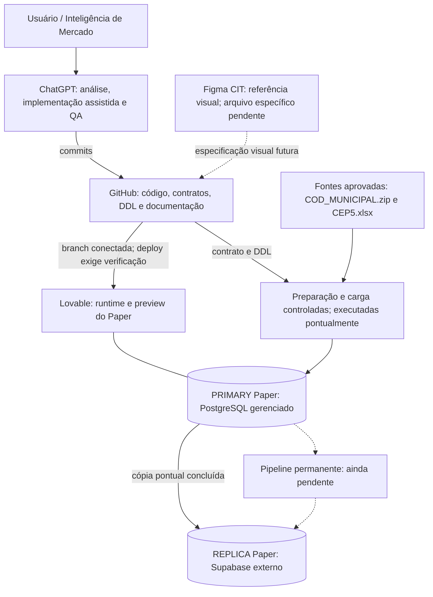
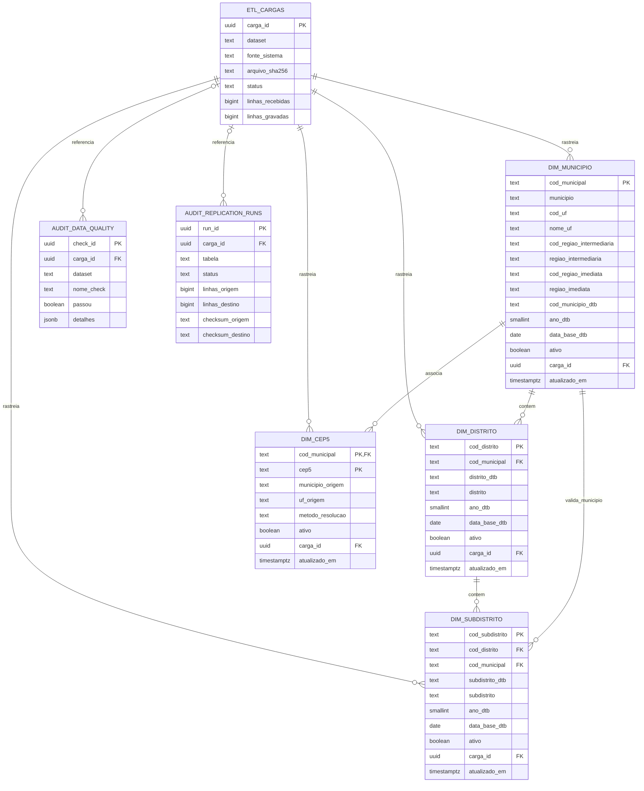
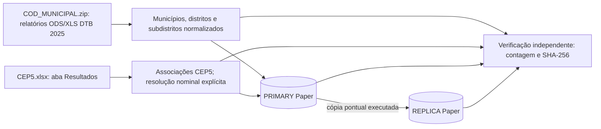
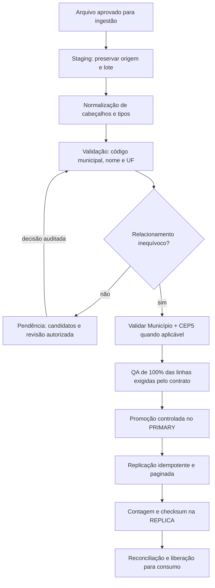
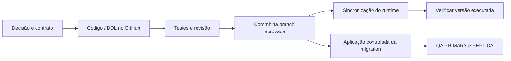

# Mapa de engenharia — CIT / Paper Comercial V2

> **Snapshot auditado em 15/09/2026.** Base de código inspecionada: `aedaaef212d0a60c448bb1b55642e6cbaf046bd4`.
> Documento de arquitetura existente, lacunas e continuidade. Não é declaração de que toda a plataforma está pronta.
> Escopo exclusivo: este repositório, seus arquivos-fonte, seu Lovable PRIMARY, sua REPLICA Supabase e seu workspace Figma.

## 1. A conclusão que organiza todo o projeto

**A fundação e os dados geográficos estão implementados. O pipeline automático de ingestão, revisão, replicação e reconciliação ainda não está implementado/homologado no CIT/Paper.**

Existem quatro dimensões carregadas e equivalentes nos dois bancos. Existem tabelas para rastrear cargas, qualidade e replicação. Isso não significa que existam serviços permanentes executando essas etapas automaticamente.

A interface atual é uma tela neutra de reconstrução. Não há fluxo funcional de importação, revisão municipal, concorrência ou demografia ligado a ela. A infraestrutura de autenticação foi preservada, mas o login e a autorização do produto V2 ainda precisam de implementação e validação.

### Vocabulário de status

| Status | Significado neste mapa |
|---|---|
| **Verificado** | Confirmado por leitura do código, arquivo-fonte, catálogo ou consulta ao banco nesta auditoria. |
| **Executado pontualmente** | A operação ocorreu e há resultado verificável; não equivale a automação permanente. |
| **Diretriz definida** | Arquitetura ou intenção acordada; implementação ainda ausente ou não homologada. |
| **Pendente** | Falta construir, corrigir, decidir ou provar o comportamento. |
| **Não verificado** | O acesso ou o teste necessário não foi realizado; não inferir conclusão. |

## 2. Mapa de contexto e fronteiras



Setas contínuas representam relações existentes ou operações já executadas. Setas pontilhadas representam intenção, etapa pendente ou integração não comprovada ponta a ponta. A cópia entre bancos não está rodando continuamente.

### Identificação dos ambientes

| Elemento | Identificador | Papel e limite |
|---|---|---|
| Repositório | `Kaue-EDBS/papercomercialv2` | Fonte versionada do projeto. |
| Branch operacional | `main` | Histórico publicado não deve ser reescrito. |
| Lovable | `8380d53b-a14d-4993-9447-d7c404347336` | Projeto `Paper Comercial OFICIAL`, runtime e PRIMARY. |
| Supabase externo | `vevmnoxbjdkibdwfygfn` | REPLICA do Paper; não é origem de dados operacionais. |
| Configuração existente | `chwsmkdkgdgocnbcyvmq` | Valor de `supabase/config.toml`; associação ao backend PRIMARY é inferência, não confirmação administrativa. |
| Figma | time `CIT`, `1681665672034047133` | Workspace de UX. Link direto de arquivo/fileKey ainda ausente. |

**Não substituir o ID de `config.toml` pelo da REPLICA.** A distinção PRIMARY/REPLICA não é uma convenção cosmética: determina de onde saem os dados autoritativos e para onde ocorre eventual reparo.

Nenhum ambiente de outro projeto faz parte deste mapa. A fundação já incorporada pertence agora ao próprio Paper e deve evoluir a partir de seus contratos.

## 3. Inventário físico dos bancos

Consultas independentes aos dois bancos confirmaram sete tabelas persistentes de aplicação em `public`.

| Tabela | Colunas | PRIMARY | REPLICA | Função |
|---|---:|---:|---:|---|
| `etl_cargas` | 16 | 2 | 2 | Registro das cargas DTB e CEP5. |
| `audit_data_quality` | 8 | 2 | 2 | Resultados registrados dos checks das duas cargas. |
| `audit_replication_runs` | 16 | 1 | 0 | Histórico de operações de replicação; **não está espelhado integralmente**. |
| `dim_municipio` | 14 | 5.571 | 5.571 | Cadastro municipal canônico e seus atributos regionais. |
| `dim_distrito` | 9 | 10.751 | 10.751 | Distritos vinculados a municípios. |
| `dim_subdistrito` | 10 | 646 | 646 | Subdistritos vinculados a distrito e município. |
| `dim_cep5` | 8 | 24.905 | 24.905 | Associações entre município canônico e prefixo postal. |

Total nas quatro dimensões: **41.873 registros por banco**. Não somar as linhas técnicas de auditoria como se fossem unidades territoriais.

As assinaturas estruturais das sete tabelas coincidiram entre PRIMARY e REPLICA, considerando colunas, tipos, nulidade, defaults, constraints, índices e flag RLS. Isso não significa identidade de usuários, extensões, ACLs administrativas, comentários ou metadados de toda a plataforma.

### O que não existe como tabela de aplicação

Não foram encontradas tabelas de staging persistente, fila de ingestão, lote de validação municipal, resoluções manuais, exceções reutilizáveis ou registry de replicação. Também não existe ainda cadastro de escolas/clientes nem tabelas de demografia, concorrência, adoção ou propostas na V2.

## 4. Modelo relacional existente



O diagrama mostra todos os campos das quatro dimensões e os campos de referência das tabelas técnicas. O DDL é a fonte do dicionário completo.

### Hierarquia de apresentação versus relacionamento de dados

UF, região intermediária e região imediata são atributos de `dim_municipio`; **não existem tabelas físicas separadas para esses três níveis**. A interface futura pode apresentar essa árvore sem exigir que todos os datasets sejam relacionados por cada nível.

```text
UF
  Região Geográfica Intermediária
    Região Geográfica Imediata
      Município
        ├─ Distrito
        │    └─ Subdistrito
        └─ Associação Município + CEP5
```

Distritos/subdistritos dão contexto territorial. O CEP5 forma um ramo operacional próprio e não deve ser colocado artificialmente dentro de um distrito. Não há geometria, polígonos ou distância física armazenados nessas dimensões.

## 5. Identidade e integridade territorial

O cabeçalho lógico de ingestão é `COD_MUNICIPAL`; no PostgreSQL o identificador físico é `cod_municipal`. O código municipal é `text` com sete dígitos. A dimensão municipal mantém exatamente 14 colunas.

A PK de `dim_cep5` é **`(cod_municipal, cep5)`**. Existem 24.896 valores de CEP5 e 24.905 associações: nove prefixos aparecem em dois municípios. Uma consulta por CEP5 isolado pode devolver múltiplas associações e não autoriza escolher o primeiro resultado.

**Correção documental identificada nesta auditoria:** são **4.495 registros e 4.495 CEP5 distintos iniciados por zero**, não 248. A contagem foi conferida no XLSX original, no CSV normalizado, no PRIMARY e na REPLICA. O problema estava na descrição anterior; os dados estão preservados como texto.

Há 5.570 municípios cobertos pela fonte CEP5. O município `5101837` existe na DTB e não tem associação nessa fonte. Essa ausência não é código inválido nem motivo para inativar o município; é uma limitação de cobertura do arquivo.

As três correspondências nominais explicitamente tratadas na carga são:

| UF | Texto da fonte CEP5 | Nome canônico | Código |
|---|---|---|---|
| RR | São Luiz | São Luiz do Anauá | `1400605` |
| RN | Arês | Arez | `2401206` |
| RN | Açu | Assú | `2400208` |

`metodo_resolucao` registra `EXATO` ou `ALIAS_HOMOLOGADO` nas linhas carregadas. **Isso não é um motor genérico de aliases:** não existe ainda tabela reutilizável de exceções nem tela para homologar futuras correções.

## 6. Linhagem e prova de equivalência dos dados



Arquivos originais auditados:

| Arquivo | SHA-256 dos bytes |
|---|---|
| `COD_MUNICIPAL.zip` | `a5947915a7213cddde00682a51d0734ea6b6ec2307d237d1e7937edde6766b99` |
| `CEP5.xlsx` | `74ad34907a4ee418ededa872d3530cc11ae89270ed666331a6879ea72cb8cf13` |

Os relatórios ODS do ZIP foram relidos nesta auditoria; suas linhas normalizadas coincidiram com os CSVs. O XLSX CEP5 também foi relido e resolvido contra a geografia original, usando somente os três aliases explícitos. Os quatro conjuntos resultantes coincidiram com os hashes calculados nos dois bancos.

### Protocolo de checksum desta auditoria

Nome: **`sha256-json-array-lines-v1`**.

Para cada tabela: selecionar as colunas de dados na ordem definida; representar cada linha como array JSON com os tipos preservados; ordenar pela PK; concatenar linhas com LF, sem LF final; codificar em UTF-8; calcular SHA-256. No PostgreSQL, a representação utilizada é `jsonb_build_array(...)::text`.

`carga_id` e `atualizado_em` ficam fora do checksum de negócio. A exclusão é deliberada: metadados de execução não devem confundir comparação de conteúdo territorial. Eles continuam auditáveis separadamente.

| Tabela | Linhas | SHA-256, idêntico em fonte normalizada / PRIMARY / REPLICA |
|---|---:|---|
| `dim_municipio` | 5.571 | `44b2d93b700d03b11ddb81ca1688b2d2f599e7eeffef2d6b3ab2cb2fd57d70f3` |
| `dim_distrito` | 10.751 | `5e3bfea56b4c8b82ca6f8a92f8ecd9f82ac4bfacc7c5825a8d5fdd5284dc3679` |
| `dim_subdistrito` | 646 | `2c9aeef8a0df9882883ae042decea8cf799d7b0e516292c30fc44b0ec83d981a` |
| `dim_cep5` | 24.905 | `346285b67463ee58bd2e27f30d46e59281cb9c6ef095c3d5e4389e5f7d884b56` |

Os checksums de 32 caracteres registrados nas cargas anteriores são **MD5 históricos**, não SHA-256. Não comparar algoritmos ou protocolos diferentes, nem sobrescrever retrospectivamente uma evidência histórica para parecer que ela foi produzida por outro método.

Esta auditoria leu os bancos; não inseriu novos runs nem alterou estados de carga. Os novos hashes ficam documentados no repositório.

## 7. Cargas, qualidade e auditoria: três coisas diferentes

### `etl_cargas`

Registra a existência e o resultado de cada carga. As duas cargas estão `concluida` nos dois bancos:

| Dataset | carga_id | Registros gravados |
|---|---|---:|
| `geografia_dtb_2025` | `934dafbe-0d0c-4463-8600-3faf0e623026` | 16.968 |
| `geografia_cep5` | `42229071-a0a3-4c0d-a8a8-14d7ead5895e` | 24.905 |

### `audit_data_quality`

Há dois checks registrados em cada ambiente: `e2e_dtb_2025` e `e2e_cep5`. Ambos estão aprovados. Apesar do nome, esses registros comprovam QA das cargas, **não um E2E da futura interface de upload/revisão/replicação automática**.

### `audit_replication_runs`

No PRIMARY há um run de CEP5 concluído, `7212a290-0884-4b2c-b7d0-6c49aac4033e`. Na REPLICA não há runs. Não foram encontrados runs individuais de replicação DTB nessa tabela.

Consequência: **há paridade dos dados geográficos, mas a trilha de replicação ainda é parcial**. Não declarar que os bancos inteiros são cópias idênticas. O escopo de replicação dos metadados e a política de espelhamento da auditoria precisam ser formalizados. Um eventual backfill deve ser identificado como reconciliação posterior, nunca como evento histórico inventado.

## 8. O pipeline: o que existe e o que falta

| Etapa | Estado observado no CIT/Paper | O que falta para operação permanente |
|---|---|---|
| Fonte e contrato geográfico | Implementados e versionados | Guardar os arquivos originais em destino durável com acesso controlado e política de retenção. |
| Normalização e resolução desta carga | Executadas e verificadas | Empacotar processo reproduzível e testado, sem depender de uma sessão de chat. |
| PK, formato e FK | Constraints existentes | Validações de semântica/ambiguidade antes da gravação. |
| Auditoria de cargas/qualidade | Tabelas existentes; dois eventos de cada tipo | Orquestrador que grave eventos com tratamento de falha. |
| `validate-cod-municipal` | Sem implementação V2 versionada/homologada | Contrato de entrada/saída, autenticação, paginação e testes negativos. |
| Staging e pendências | Ausentes | Preservar todas as colunas originais, linhas, versão e estado do lote. |
| Exceções reutilizáveis | Ausentes | Escopo por fonte, responsável, motivo e homologação explícita. |
| Revisão humana | Interface ausente | Modal funcional, autorização e persistência auditável. |
| Replicação | Cópia pontual executada | Registry/allowlist, checkpoints, lotes idempotentes, retomada e autenticação entre ambientes. |
| Reconciliação | Comparações pontuais realizadas | Rotina reutilizável, execução agendada se aprovada, alerta e estratégia de reparo. |
| Publicação para consumo | Não implementada como gate | Impedir consumo de lote incompleto ou reprovado. |
| E2E do pipeline completo | Não realizado | Upload → correção → promoção → réplica → reconciliação, incluindo falhas. |

### Fluxo-alvo, não implementação atual



Diretrizes a preservar na implementação futura: saída normalizada com `COD_MUNICIPAL`; recuperação por Município + UF apenas quando inequívoca; fuzzy apenas sugere; homologação de exceções reutilizáveis deve ser opt-in; validação de 100% refere-se ao conjunto recebido, não à cobertura nacional.

Caso código válido e nome/UF apontem para municípios distintos, não escolher silenciosamente uma fonte. O contrato do serviço deve definir o tratamento do conflito antes de autorizar correção. CEP5 não serve como fuzzy numérico nem como substituto automático do município.

## 9. Edge Functions, RPCs e serviços

A árvore Git auditada não contém `supabase/functions/` nem implementações V2 de validação, revisão, replicação ou reconciliação. A listagem administrativa da REPLICA retornou **zero Edge Functions**. O catálogo completo de Edge Functions do backend gerenciado PRIMARY não foi obtido por acesso administrativo independente; portanto não se afirma ausência de todo e qualquer deploy fora do repositório.

As consultas ao catálogo `public` de ambos os bancos não encontraram funções SQL próprias de aplicação. Os helpers `tmp_*` utilizados para carga não permanecem no escopo verificado.

**Regra operacional:** sem código versionado, configuração de deploy, autenticação e teste HTTP/E2E, nenhum serviço deve ser apresentado como implementado/homologado. Ter uma extensão instalada, um SDK no package.json ou uma tabela de auditoria não cria esse serviço.

A REPLICA é um banco separado alimentado por operações de aplicação; não há subscription PostgreSQL nem rotina `cron.job` instalada nos bancos auditados. A ausência de cron no banco não prova ausência de agendadores externos; nenhum agendador externo do pipeline foi identificado ou homologado nesta auditoria.

## 10. Frontend e stack de código

A base declarada em `package.json` é React/Vite/TypeScript. As versões declaradas incluem React `^18.3.1`, Vite `^5.4.19`, TypeScript `^5.8.3`, Tailwind `^3.4.17`, `@supabase/supabase-js` `^2.110.1` e `@tanstack/react-query` `^5.83.0`. São requisitos declarados, não medição do runtime publicado.

| Caminho | Estado e significado |
|---|---|
| `src/main.tsx` | Bootstrap React. |
| `src/App.tsx` | Tela estática de fundação; não consulta as dimensões. |
| `src/components/ui/` | Componentes genéricos; um Dialog genérico não é a revisão municipal. |
| `src/hooks/use-mobile.tsx`, `use-toast.ts` | Utilidades de interface, não regras comerciais. |
| `src/lib/utils.ts` | Utilidade genérica. |
| `src/integrations/supabase/client.ts` | SDK de runtime baseado em variáveis de ambiente. |
| `src/integrations/supabase/previewAuthStorage.ts` | Infraestrutura de sessão/preview; não é política de autorização do produto. |
| `src/integrations/supabase/types.ts` | Tipagem apenas das três tabelas técnicas; as quatro dimensões ainda estão ausentes. |
| `src/index.css`, `tailwind.config.ts` | Estilos/tokens preservados, não design system V2 aprovado no Figma. |

Há dependências históricas no manifesto, inclusive bibliotecas de mapas/exportação. Sua presença não significa que as funcionalidades comerciais tenham sido reativadas. Revisão de dependências e lockfile deve ocorrer em etapa própria.

O texto atual de `App.tsx` ainda diz que não existe dataset de negócio e que o PRIMARY contém somente a fundação. **Esse texto está desatualizado em relação ao banco.** Foi documentado como pendência, sem alterar a interface nesta rodada.

## 11. Autenticação e autorização

| Elemento | PRIMARY | REPLICA | Interpretação |
|---|---:|---:|---|
| `auth.users` | 28 | 0 | Contas da plataforma foram preservadas no PRIMARY. |
| `auth.identities` | 28 | 0 | Identidades existentes; nenhum dado pessoal foi reproduzido neste mapa. |
| Tela de login V2 | Não implementada na tela atual | Não se aplica | SDK presente não equivale a login funcional. |
| Perfis/permissões do produto | Não formalizados na V2 | Não se aplica | Necessário antes de expor revisão/carga/dados. |

Não excluir essas contas como consequência automática de uma limpeza de negócio. Também não assumir que continuam autorizadas no produto V2. É preciso decidir quem administra cargas, quem revisa exceções e quem consome os dados.

Provedores, signup público, MFA, políticas de senha, recuperação e sessões ativas não foram auditados. Não foi feito login real nem teste de autorização entre perfis.

## 12. Segurança e infraestrutura preservada

As sete tabelas estão com RLS ativo. Foi verificada a ausência de privilégios efetivos de tabela para `anon` e `authenticated`, inclusive SELECT e operações de escrita. A auditoria de segurança Supabase da REPLICA retornou sete avisos informativos de RLS sem policy; isso é compatível com o fechamento atual para usuários finais.

Grants e RLS são controles diferentes: grants determinam acesso ao objeto, e policies RLS determinam linhas acessíveis. Quando o consumo for implementado, conceder somente os privilégios e policies necessários, sem desativar RLS como atalho. Referência técnica: https://supabase.com/docs/guides/api/securing-your-api

Estado adicional observado:

- zero buckets e zero objetos no Storage de ambos os ambientes;
- zero funções SQL próprias de aplicação em `public`;
- sem helpers `tmp_*` no escopo inspecionado;
- extensão `http` ainda instalada no PRIMARY; não instalada na REPLICA;
- demais extensões de plataforma preservadas.

A extensão HTTP remanescente não prova uma conexão ativa nem um vazamento. Deve ser revisada para decidir se ainda tem finalidade. Nada foi removido nesta auditoria.

Existe `.env` rastreado no Git. Seu conteúdo não foi aberto nem reproduzido nesta rodada. Isso é uma pendência de classificação de credenciais, não prova de que há segredo exposto. Se forem encontradas credenciais privilegiadas, será necessária rotação; apenas apagar o arquivo atual não elimina o histórico.

## 13. GitHub, DDL e deploy

Migrations canônicas presentes:

| Arquivo | Papel | Conduta |
|---|---|---|
| `0000_reset_legacy.sql` | Registro reproduzível do reset de negócio | Não reaplicar sobre dados atuais como bootstrap de rotina. |
| `0001_foundation.sql` | Três tabelas técnicas | Preservar e evoluir por migrations novas. |
| `0002_geografia_dtb_2025_cep5.sql` | Quatro dimensões geográficas | Estrutura existente; não recriar do histórico legado. |

`database/v2/` é a fonte oficial de DDL. As migrations antigas de negócio foram removidas da branch vigente. Metadados internos de migrations nos provedores podem continuar existindo e não reativam regras antigas.



**Commit de SQL não é evidência de migration aplicada. Commit de função não é evidência de deploy. Deploy não é evidência de teste.** Cada camada exige verificação separada.

Não enviar prompts ao agente do Lovable para implementar código. A operação técnica do banco precisa seguir SQL previamente versionado, escopo aprovado e evidência posterior. Nesta rodada de mapa, as consultas foram somente leitura e as alterações ficaram na documentação/repositório.

## 14. Testes e verificações realmente realizados

| Verificação | Resultado |
|---|---|
| Leitura da árvore Git e arquivos centrais | Realizada no commit de referência. |
| Contagens das sete tabelas nos dois bancos | Realizada. |
| Schema: tipos, defaults, constraints, índices e RLS | Assinaturas iguais nas sete tabelas. |
| Privilégios efetivos de `anon`/`authenticated` | Nenhum nas sete tabelas. |
| Conteúdo das quatro dimensões | Fonte original normalizada = CSV = PRIMARY = REPLICA por SHA-256. |
| FKs, hierarquia e CEP5 | Zero órfãos/erros nos checks consultados; nove prefixos compartilhados. |
| Zero à esquerda | 4.495 registros confirmados; descrição antiga corrigida. |
| Catálogo de funções da REPLICA | Zero Edge Functions. |
| Figma | Identidade/time/assento confirmados; arquivo visual não identificado. |
| Build, lint e testes do app | Não executados nesta auditoria. |
| Navegação e login no runtime publicado | Não verificados. |
| E2E de upload e revisão | Não realizado; funcionalidades ainda ausentes. |
| Recuperação após falha de replicação | Não testada; pipeline permanente pendente. |

Há configuração de Vitest/Playwright no repositório, mas o teste de exemplo inspecionado apenas verifica `expect(true).toBe(true)`. Isso não cobre regra de negócio nem paridade. Não foram encontrados workflows CI na árvore auditada. O clone local falhou por resolução DNS de `github.com`; não se deve converter essa falha em alegação de build aprovado.

## 15. Figma e camada de UX

O workspace oficial é o time CIT. A conexão consultada retornou plano Starter e assento View. `SIGMA` é nome antigo/incorreto informado pelo usuário, não um segundo produto.

O link registrado é de time/workspace, não de arquivo Design/FigJam. Portanto não foram inspecionados frames, componentes, tokens ou fluxos do arquivo. Estar em um time não prova permissão de edição em um arquivo específico. O acesso depende do link e das permissões do conteúdo: https://developers.figma.com/docs/figma-mcp-server/rate-limits-access/

Nenhum arquivo visual novo foi criado para substituir o arquivo existente. Os diagramas deste mapa são Mermaid versionado no GitHub, não alterações no Figma. O próximo passo de UX é registrar o link direto/fileKey do arquivo correto e validar acesso antes de desenhar telas.

## 16. Pendências priorizadas

As prioridades abaixo são uma proposta de execução, não autorização para modificar produção automaticamente.

| ID | Prioridade | Pendência | Critério objetivo de conclusão |
|---|---|---|---|
| P01 | Alta, antes de expor o produto | Classificar `.env` e credenciais | Inventário sem valores em logs; rotação quando necessária; política de versionamento. |
| P02 | Alta, antes de UI conectada | Completar tipos das quatro dimensões | Tipos fiéis ao PRIMARY e typecheck executado. |
| P03 | Alta, antes de ingestão autônoma | Implementar gate municipal/CEP5 e staging | Arquivo misto inválido bloqueado, campos preservados e correções auditadas. |
| P04 | Alta, antes de uso por pessoas | Definir e implementar autenticação/autorização | Papéis aprovados, testes de acesso permitido/negado, contas preservadas tratadas explicitamente. |
| P05 | Alta, antes de atualização recorrente | Replicação e reconciliação permanentes | Paginação, idempotência, retomada, exclusões, checksum e falha simulada testados. |
| P06 | Média | Completar trilha de replicação | Política PRIMARY/REPLICA documentada e eventos novos completos; backfill identificado como posterior. |
| P07 | Média | Corrigir textos da tela neutra | Texto reflete dados carregados sem reativar regras comerciais. |
| P08 | Média | CI, build e testes reais | Execuções registradas, lockfile/gerenciador definidos e testes de integridade/serviços. |
| P09 | Média | Fonte durável e reprocessamento | Originais recuperáveis por hash e procedimento reproduzível de carga/restauração. |
| P10 | Média | Identificar arquivo Figma | fileKey e permissões confirmados, sem criar cópia desnecessária. |
| P11 | Baixa | Rever extensão HTTP e dependências residuais | Remover só o que for comprovadamente dispensável, com commit e teste. |

## 17. Requisitos mínimos para o pipeline futuro

Para evitar repetir operações pontuais difíceis de retomar, o pipeline deve possuir identidade de lote, hash da origem, versão de contrato, estado persistido e limite de tamanho. Um lote não deve ser promovido porque apenas o último bloco enviado passou: a aprovação precisa considerar o conjunto completo.

A revisão humana deve registrar usuário autorizado, valor original, código escolhido, motivo e momento da decisão. A opção de memorizar correção precisa ser explícita e limitada à fonte aprovada. Códigos válidos mas conflitantes, cabeçalhos duplicados e CEP5 ambíguos precisam de comportamento definido e testado.

A replicação deve restringir tabelas e colunas por allowlist, respeitar a ordem das FKs e usar o mesmo identificador de lote. Upsert sozinho não garante remoção de registros que deixaram de existir: a política de snapshot, exclusão lógica ou tombstones precisa constar no contrato. Repetir o mesmo lote não pode gerar duplicidade, eventos enganosos ou alteração silenciosa do conteúdo.

A reconciliação deve comparar o mesmo escopo e a mesma versão do conjunto. Não deve declarar paridade entre uma origem mudando durante a leitura e um destino congelado. O desenho deve tratar checkpoints, concorrência, falhas de rede, divergência de schema e recuperação sempre a partir do PRIMARY.

Esses são requisitos de engenharia para implementação futura; não aparecem como serviços concluídos neste mapa.

## 18. O que permanece deliberadamente sem definição

Não estão definidos os critérios comerciais de concorrência, distância/raio, ranking, segmentação, pesos ou metodologia demográfica. CEP5 é referência de relacionamento, não uma fórmula de concorrência pronta nem uma área geométrica conhecida.

Também não estão aprovadas a identidade escolar, a relação entre identificadores ERP e INEP, o esquema de escolas/clientes, adoção, oferta, estoque ou proposta. Nenhum desses domínios deve voltar do histórico por inferência.

## 19. Roteiro de retomada

1. Ler este mapa, `AGENTS.md`, o contrato geográfico e o snapshot de evidências.
2. Confirmar o commit e o estado atual dos ambientes antes de continuar; este documento é datado.
3. Preservar as quatro dimensões existentes; não repetir reset ou recarga por falta de memória.
4. Decidir o próximo escopo: saneamento técnico, pipeline permanente ou novo contrato de dados.
5. Implementar somente o escopo aprovado via GitHub/commit.
6. Separar código escrito, deploy, teste e resultado em banco na comunicação final.
7. Atualizar README, mapa e evidências quando houver mudança estrutural.

**Ponto de retomada:** geografia e CEP5 íntegros e carregados; interface comercial neutralizada; serviços automáticos de ingestão/revisão/replicação ainda pendentes. As próximas ações devem partir daqui, não de uma suposição de plataforma totalmente pronta.
