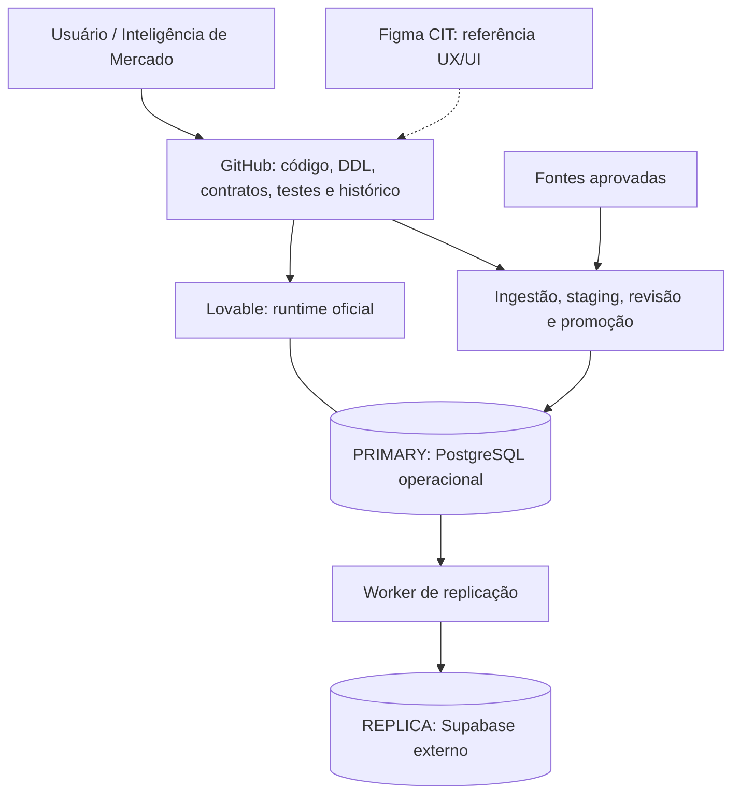
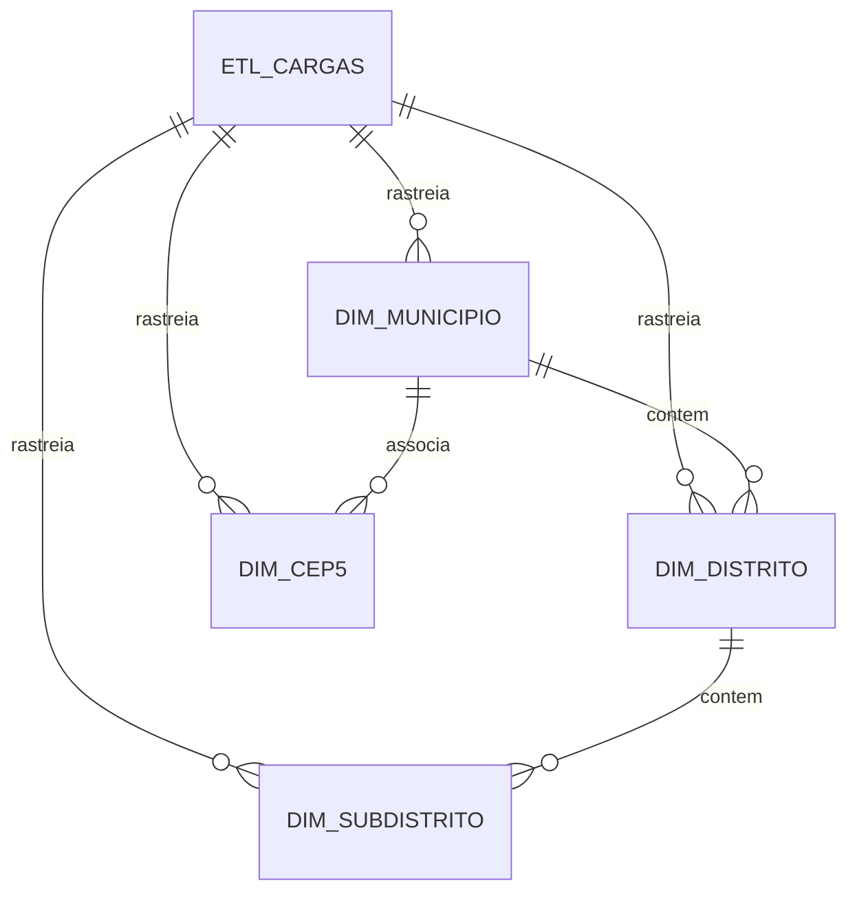

# Mapa de engenharia — CIT / Paper Comercial V2

> **Atualizado em 16/09/2026.** Este documento é o mapa técnico e histórico da V2: mostra o que foi decidido, implementado, validado, o que ainda está pendente e como interpretar os principais termos. Não é uma declaração de que o produto comercial esteja concluído.
>
> Escopo exclusivo: `Kaue-EDBS/papercomercialv2`, Lovable PRIMARY, Supabase REPLICA, fontes aprovadas do Paper e Figma CIT.

## 1. A ideia que organiza toda a V2

A V2 não foi tratada como continuação automática do sistema anterior. Ela foi reconstruída sobre uma fundação nova para evitar que regras, dependências ou comportamentos legados voltassem sem nova homologação.

A sequência real do projeto foi:

```text
reset controlado do legado
→ foundation
→ geografia DTB 2025
→ CEP5
→ prova de paridade por hash
→ ingestão/staging/revisão
→ roles e grants
→ replicação permanente
→ CI e preflight
→ conexão real PRIMARY → REPLICA
→ E2E
→ regras comerciais
```

Hoje o projeto está entre **replicação permanente** e **E2E real**. A REPLICA está conectada; o PRIMARY ainda apresenta bloqueio de conexão externa pelo ambiente Lovable.

## 2. Vocabulário de status

| Status | Significado |
|---|---|
| **Verificado** | Confirmado por código, consulta, execução ou artefato. |
| **Implementado** | Existe no GitHub e passou pelos testes aplicáveis. |
| **Aplicado** | Migration/alteração foi executada no ambiente indicado. |
| **Validado** | O resultado foi testado depois da aplicação. |
| **Pendente** | Falta executar, decidir ou provar. |
| **Não analisado** | Existe uma execução/resultado, mas ainda não foi inspecionado. |

Essas palavras não são intercambiáveis. Código escrito não significa deploy; deploy não significa teste; teste de CI não significa produção conectada.

## 3. Arquitetura oficial e fronteiras



### Fontes da verdade

| Camada | Responsabilidade |
|---|---|
| GitHub | Código, migrations, DDL, contratos, testes, decisões e documentação. |
| Lovable PRIMARY | Runtime e dado operacional autoritativo. |
| Supabase REPLICA | Cópia independente. Não escreve de volta no PRIMARY. |
| Figma | Referência visual; não define regra comercial. |
| Arquivos homologados | Origem dos datasets. |

Direção autorizada: **PRIMARY → REPLICA**.

Nenhum outro projeto ou banco participa do CIT/Paper sem decisão explícita.

## 4. Identificação dos ambientes

| Elemento | Identificador |
|---|---|
| Repositório | `Kaue-EDBS/papercomercialv2` |
| Branch operacional | `main` |
| Lovable oficial | `8380d53b-a14d-4993-9447-d7c404347336` |
| Projeto | `Paper Comercial OFICIAL` |
| URL publicada | `https://cit-edbs.lovable.app` |
| Project ref usado pela aplicação | `chwsmkdkgdgocnbcyvmq` |
| Supabase REPLICA | `vevmnoxbjdkibdwfygfn` |
| Região REPLICA | `sa-east-1` |
| Figma | time `CIT`, Team ID `1681665672034047133` |

`supabase/config.toml` permanece com `project_id = "chwsmkdkgdgocnbcyvmq"`. Não substituir pelo ID da REPLICA.

## 5. Linha do tempo técnica da V2

### 5.1 Reset controlado

A migration `0000_reset_legacy.sql` registra o reset inicial dos objetos comerciais antigos. Estruturas gerenciadas da plataforma foram preservadas.

Regra: **não reaplicar `0000` sobre o estado atual**.

### 5.2 Foundation

`0001_foundation.sql` criou:

- `etl_cargas`
- `audit_data_quality`
- `audit_replication_runs`

Objetivo: cada carga e cada verificação precisa ter rastreabilidade.

### 5.3 Geografia

`0002_geografia_dtb_2025_cep5.sql` criou:

- `dim_municipio`
- `dim_distrito`
- `dim_subdistrito`
- `dim_cep5`

A geografia foi escolhida como primeiro domínio porque município, UF, CEP5, território, demografia e futura concorrência dependem dessa base.

### 5.4 Ingestão

`0003_cit_ingestion_access.sql` criou a camada de ingestão, grants, staging e revisão.

### 5.5 Controle de replicação

`0004_replication_control.sql` criou jobs, páginas e itens de replicação.

### 5.6 Roles técnicas

`0005_replication_roles.sql` criou os grupos de menor privilégio para origem e destino.

### 5.7 Login principals

`0006_replication_login_principals.sql` criou os usuários técnicos usados pelo worker.

## 6. Modelo físico atual

### Foundation pública

| Tabela | Papel |
|---|---|
| `etl_cargas` | Linhagem e estado das cargas. |
| `audit_data_quality` | Checks de qualidade. |
| `audit_replication_runs` | Auditoria de replicação/reconciliação. |

### Geografia pública

| Tabela | Registros validados |
|---|---:|
| `dim_municipio` | 5.571 |
| `dim_distrito` | 10.751 |
| `dim_subdistrito` | 646 |
| `dim_cep5` | 24.905 |

Total das dimensões: **41.873 registros**.

### Camada privada

Principais estruturas em `cit_private`:

- `access_grants`
- `ingestion_batches`
- `ingestion_rows`
- `review_events`
- `municipality_aliases`
- `replication_jobs`
- `replication_pages`
- `replication_items`

## 7. Modelo relacional geográfico



Hierarquia de apresentação:

```text
UF
  → Região Intermediária
    → Região Imediata
      → Município
        ├─ Distrito → Subdistrito
        └─ Município + CEP5
```

UF e regiões são atributos de `dim_municipio`; não existem tabelas físicas separadas para esses níveis.

## 8. Geografia DTB 2025

Fonte: `COD_MUNICIPAL.zip`.

SHA-256:

```text
a5947915a7213cddde00682a51d0734ea6b6ec2307d237d1e7937edde6766b99
```

Carga:

```text
geografia_dtb_2025
934dafbe-0d0c-4463-8600-3faf0e623026
```

Resultados:

- 5.571 municípios;
- 10.751 distritos;
- 646 subdistritos;
- 27 UFs;
- 133 regiões intermediárias;
- 510 regiões imediatas;
- zero duplicidade de PK identificada;
- zero falha de FK/hierarquia nos checks executados.

`COD_MUNICIPAL` é texto de sete dígitos e é a referência territorial canônica atual.

## 9. CEP5

Fonte: `CEP5.xlsx`, aba `Resultados`.

SHA-256:

```text
74ad34907a4ee418ededa872d3530cc11ae89270ed666331a6879ea72cb8cf13
```

Carga:

```text
geografia_cep5
42229071-a0a3-4c0d-a8a8-14d7ead5895e
```

Resultados:

- 24.905 associações;
- 24.896 CEP5 distintos;
- 5.570 municípios cobertos;
- 27 UFs;
- 4.495 CEP5 iniciados por zero;
- nove CEP5 compartilhados entre municípios.

A chave correta é **`(cod_municipal, cep5)`**.

Aliases homologados:

| UF | Fonte | Canônico | Código |
|---|---|---|---|
| RR | São Luiz | São Luiz do Anauá | `1400605` |
| RN | Arês | Arez | `2401206` |
| RN | Açu | Assú | `2400208` |

Boa Esperança do Norte/MT (`5101837`) existe na DTB e não aparece na fonte CEP5. Nenhum CEP foi inventado para preencher a ausência.

## 10. Prova de equivalência

Protocolo: **`sha256-json-array-lines-v1`**.

Passos conceituais:

1. escolher colunas de negócio fixas;
2. ordenar por PK;
3. representar cada linha como array JSON preservando tipos;
4. concatenar com LF, sem LF final;
5. codificar em UTF-8;
6. calcular SHA-256.

| Tabela | SHA-256 |
|---|---|
| `dim_municipio` | `44b2d93b700d03b11ddb81ca1688b2d2f599e7eeffef2d6b3ab2cb2fd57d70f3` |
| `dim_distrito` | `5e3bfea56b4c8b82ca6f8a92f8ecd9f82ac4bfacc7c5825a8d5fdd5284dc3679` |
| `dim_subdistrito` | `2c9aeef8a0df9882883ae042decea8cf799d7b0e516292c30fc44b0ec83d981a` |
| `dim_cep5` | `346285b67463ee58bd2e27f30d46e59281cb9c6ef095c3d5e4389e5f7d884b56` |

Na validação histórica executada, fonte normalizada, PRIMARY e REPLICA produziram os mesmos hashes.

Isso comprova paridade geográfica naquele momento; não significa que os bancos inteiros sejam idênticos.

## 11. Ingestão e staging

Entrada controlada:

```text
cit_ingest(action, payload)
```

A implementação atual possui:

- autenticação por sessão real;
- grants explícitos;
- staging por lote;
- suporte a CSV, TSV e JSON;
- hash calculado no servidor;
- replay controlado;
- limites de tamanho e quantidade;
- validação territorial;
- revisão manual com optimistic version;
- justificativa obrigatória;
- aliases somente com opt-in explícito.

Limites técnicos definidos:

- até 8 MiB;
- até 100 mil linhas;
- até 500 chunks.

`VALIDATED` = staging validada. Não equivale a promoção automática ao domínio comercial.

## 12. Autorização de ingestão

Papéis funcionais:

- `admin`
- `operator`
- `reviewer`
- `viewer`

O primeiro admin foi concedido no PRIMARY por grant auditável. A REPLICA permanece sem usuários finais e sem grants operacionais.

## 13. Roles e usuários de replicação

### Group roles

```text
cit_replication_source
cit_replication_target
```

### Login principals

```text
cit_replication_source_login
cit_replication_target_login
```

Características:

- `LOGIN` habilitado apenas nos principals;
- sem superuser;
- sem createDB;
- sem createRole;
- sem `REPLICATION` nativo;
- sem bypassRLS;
- connection limit 2;
- membership somente no grupo necessário.

Isso segue o princípio do menor privilégio.

## 14. Worker de replicação

O worker foi construído para replicar apenas o escopo autorizado.

Características:

- direção PRIMARY → REPLICA;
- allowlist das tabelas geográficas;
- ordem município → distrito → subdistrito → CEP5;
- snapshot consistente da origem;
- lotes de 500 linhas;
- staging no destino;
- checkpoints;
- replay após interrupção;
- promoção atômica;
- auditoria;
- comparação por hash;
- gate de deleções.

Modos:

```text
check
apply
```

`check` compara. `apply` pode reparar a REPLICA a partir do PRIMARY.

`allow_deletions=false` é o padrão e deve permanecer assim até autorização explícita.

## 15. CI e testes

Existem workflows versionados e ativos:

- `CIT verification`
- `CIT database verification`
- `CIT manual replication`

Cobertura técnica atual inclui:

- testes de banco isolado;
- migrations 0001–0006 em fixture;
- ingestão;
- replicação interrompida;
- replay;
- gate de deleções;
- entrega de auditoria;
- preflight sanitizado;
- testes para impedir vazamento de credenciais em logs.

CI verde = código testado no cenário coberto. Não é evidência suficiente de conectividade real de produção.

## 16. Segurança da conexão PostgreSQL

A política escolhida é:

```text
sslmode=verify-full
```

O workflow instala o trust anchor a partir do secret:

```text
CIT_SUPABASE_CA_CERT
```

Certificado validado:

```text
Supabase Root 2021 CA
```

A primeira geração do preflight revelou falha de TLS nos dois lados. Após instalação da CA, a REPLICA passou completamente e o PRIMARY avançou até o pooler. Portanto o problema de certificado está resolvido.

## 17. Estado real da REPLICA

A REPLICA foi validada com:

- host do Session Pooler em `sa-east-1`;
- porta 5432;
- IPv4;
- `sslmode=verify-full`;
- certificado correto;
- autenticação do usuário técnico;
- `current_user` correto;
- database `postgres` correto;
- membership em `cit_replication_target` correto.

Estado: **conexão técnica concluída**.

## 18. Estado real do PRIMARY

### Validação interna

No banco PRIMARY foram confirmados:

- `cit_replication_source_login` existe;
- `LOGIN = true`;
- `CONNECT` no database = true;
- `USAGE` necessário = true;
- membership em `cit_replication_source` = true.

Portanto o usuário técnico não está ausente do PostgreSQL.

### Shared Pooler

O endpoint inicialmente utilizado foi o Shared Pooler compatível com a região `us-east-1`.

O preflight passou:

- DNS;
- IPv4;
- rede;
- porta;
- SSL;
- certificado.

Mas recebeu:

```text
FATAL: (ENOTFOUND) tenant/user not found
```

Conclusão: o Supavisor não reconheceu a combinação de tenant/usuário apresentada. A falha ocorreu antes da autenticação chegar ao PostgreSQL.

### Probe direto

Foi então implementado um probe somente leitura para:

```text
db.<project-ref>.supabase.co:5432
```

O PR correspondente passou pelo CI e foi integrado. A execução real posterior falhou novamente, porém **o motivo exato dessa última falha ainda não foi analisado**.

Não inferir se foi IPv6, DNS, autenticação, host, certificado ou outra limitação até ler essa execução.

## 19. Sequência dos principais PRs da infraestrutura

| PR | Objetivo |
|---|---|
| #2 | Foundation P01–P11 inicial, ingestão, replicação e CI. |
| #3 | Hardening de credenciais de replicação. |
| #4 | Preflight de conexão sanitizado. |
| #5 | Instalação e validação da Supabase Root CA. |
| #6 | Diagnóstico detalhado e sanitizado do PRIMARY. |
| #7 | Probe seguro da conexão direta do PRIMARY. |

Os detalhes de cada alteração permanecem no histórico GitHub. O histórico serve como evidência; regras comerciais antigas não devem ser recuperadas dele por inferência.

## 20. O que ainda não está definido no domínio comercial

Não estão homologados:

- chave canônica de escola/cliente;
- relação INEP × Protheus/ERP;
- concorrência;
- raio ou distância;
- geometria;
- papel exato do CEP5 na seleção comercial;
- demografia;
- market share;
- mensalidade;
- perfil socioeconômico;
- potencial;
- Melhor Oferta;
- Zero Estoque;
- proposta;
- prospecção;
- renovação.

Nenhuma dessas regras deve voltar automaticamente do histórico V1.

## 21. Estado por camada

| Camada | Estado em 16/09/2026 |
|---|---|
| Governança | Implementada |
| Foundation | Implementada e aplicada |
| DTB 2025 | Implementada, carregada e validada |
| CEP5 | Implementado, carregado e validado |
| Paridade geográfica histórica | Confirmada por contagem + SHA-256 |
| Ingestão/staging | Implementada |
| Grants e primeiro admin | Implementados no PRIMARY |
| Roles técnicas | Implementadas nos dois ambientes |
| Worker de replicação | Implementado e testado em CI |
| CI | Implementado e funcional |
| SSL/CA | Resolvido |
| REPLICA externa | Conectividade validada |
| PRIMARY interno | Usuário/roles validados |
| PRIMARY externo | Bloqueado; última tentativa ainda não analisada |
| Replicação permanente real | Pendente de conectividade PRIMARY |
| E2E publicado | Pendente |
| Figma fileKey | Pendente |
| Extensão HTTP residual | Revisão pendente |
| Regras comerciais | Pendente de especificação |

## 22. Glossário técnico para iniciantes

| Termo | Explicação simples |
|---|---|
| Frontend | Parte visual que o usuário utiliza. |
| Backend | Lógica executada por trás da interface. |
| PostgreSQL | Sistema de banco de dados relacional. |
| SQL | Linguagem para consultar e alterar o banco. |
| DDL | SQL usado para criar ou alterar estrutura. |
| Schema | Área lógica para organizar objetos dentro do banco. |
| PK | Chave primária; identifica unicamente uma linha. |
| FK | Chave estrangeira; cria relacionamento com outra tabela. |
| Migration | Arquivo que registra uma mudança estrutural do banco. |
| ETL | Extrair, transformar e carregar dados. |
| Staging | Área temporária de validação antes de oficializar dados. |
| Role | Identidade ou conjunto de permissões PostgreSQL. |
| Grant | Permissão concedida explicitamente. |
| RLS | Segurança que limita quais linhas podem ser acessadas. |
| PRIMARY | Banco operacional principal e autoritativo. |
| REPLICA | Cópia independente do PRIMARY. |
| Replicação | Processo de copiar/sincronizar dados entre bancos. |
| Branch | Linha paralela de desenvolvimento no Git. |
| Commit | Estado salvo e identificado do código. |
| PR | Pull Request; revisão antes de incorporar mudanças. |
| Merge | Incorporação de uma branch na versão principal. |
| CI | Testes automáticos de integração contínua. |
| Workflow | Sequência automática executada pelo GitHub Actions. |
| Runner | Máquina temporária usada para executar o workflow. |
| Secret | Credencial protegida pelo GitHub. |
| DSN | String que contém parâmetros de conexão do banco. |
| Host | Endereço do servidor. |
| Porta | Canal de rede do serviço; PostgreSQL normalmente usa 5432. |
| SSL/TLS | Criptografia da comunicação. |
| `verify-full` | Modo que valida criptografia, CA e hostname. |
| CA | Autoridade/certificado usado como raiz de confiança. |
| Pooler | Serviço intermediário que gerencia conexões ao banco. |
| Supavisor | Pooler da Supabase. |
| Tenant | Identificador de um projeto em infraestrutura compartilhada. |
| DNS | Traduz hostname para endereço de rede. |
| IPv4/IPv6 | Duas famílias de endereçamento de rede. |
| Preflight | Checagem de conexão antes do processo principal. |
| Hash | Impressão digital determinística de um conteúdo. |
| Checksum | Valor usado para conferir integridade. |
| Idempotência | Repetir a operação sem gerar duplicação indevida. |
| Replay | Retomar/repetir uma execução de forma controlada. |
| Paginação | Processar um conjunto grande em blocos. |
| Transação | Grupo de operações que deve concluir ou ser revertido como unidade. |
| E2E | Teste ponta a ponta do fluxo real. |

## 23. Ponto exato de retomada

Ao retornar ao trabalho técnico:

1. abrir a execução mais recente do `CIT manual replication` já contendo o probe direto;
2. ler o erro específico do `direct_probe`;
3. não alterar secret, host ou senha antes de classificar essa falha;
4. se a conexão direta for suportada/corrigível, formalizar a DSN correta;
5. se não for, obter o endpoint/tenant oficialmente suportado pelo Lovable;
6. executar novo `mode=check` com PRIMARY e REPLICA aprovados no preflight;
7. conferir contagens e checksums;
8. executar E2E login → upload → staging → validação → revisão → promoção → replicação;
9. revisar extensão HTTP e Figma;
10. iniciar a especificação dos domínios comerciais.

## 24. Regra de continuidade

Quando houver nova mudança estrutural, atualizar em conjunto:

- `README.md`;
- `docs/architecture/mapa-cit-paper-v2.md`;
- contratos de dados aplicáveis;
- evidências/testes correspondentes.

Isso reduz a distância entre o que o código realmente faz e o que a documentação afirma.

**Resumo atual:** a V2 já possui fundação, geografia, ingestão, segurança básica, CI e worker de replicação; a REPLICA funciona; o bloqueio técnico atual está exclusivamente na rota externa de acesso ao PRIMARY Lovable, e a última tentativa ainda precisa de diagnóstico antes de qualquer nova alteração.